# Figures

These figures are re-generated with major _MagicSoup_ updates.
On the one hand, they serve as sanity checks.
There is a test suite with unit and integration tests.
However, some things are hard to put into an automated test.
Sometimes it's easier to create a figure and take a look at it.
Some of the figures here are such kind of sanity checks
(_e.g._ [6. Simple Reaction Kinetics](#6-simple-reaction-kinetics)).
On the other hand, some plots were just created out of curiousity
about how certain aspects play out
(_e.g._ [9. Survival and Replication Rate](#9-survival-and-replication-rate)).
For details see the source code that generated each figure
[here (github.com)](https://github.com/mRcSchwering/magic-soup/blob/main/docs/create_figures.py).

## 1. Genomes

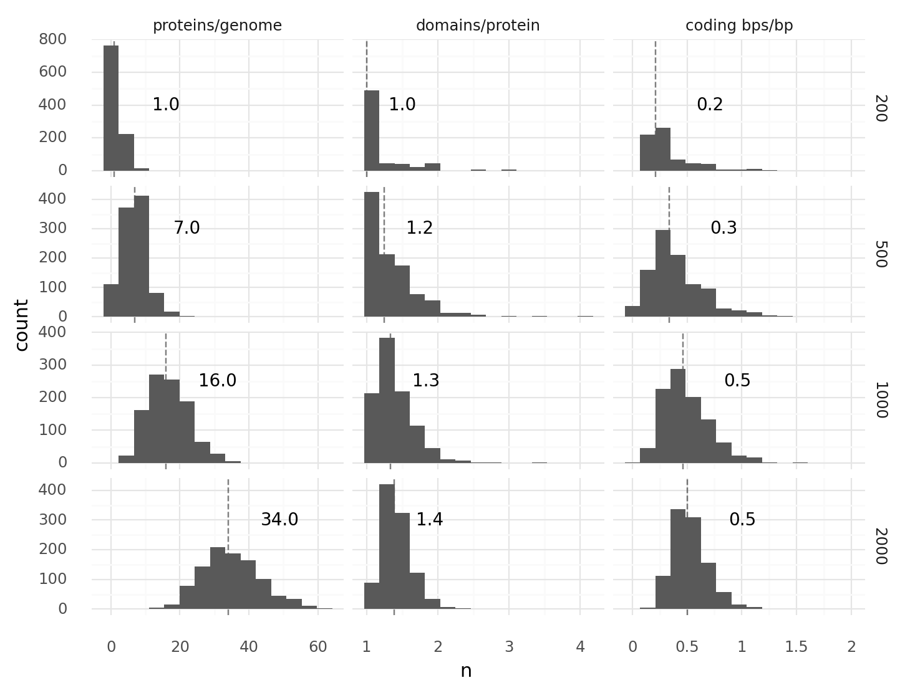

_**1.1. Genome compositions at different genome sizes.**
1000 random genomes of lengths 200, 500, 1000, or 2000 each were generated, transcribed, and translated.
For every cell the number proteins per genome, domains per protein, and coding base pairs per base pair were recorded.
Coding base pairs are base pairs which are part of at least 1 domain.
Dashed lines with numbers describe medians.
There were 3 start and 3 stop codons.
Each domain type appeared with a frequency of 1% in all 2 codon tuples._

 

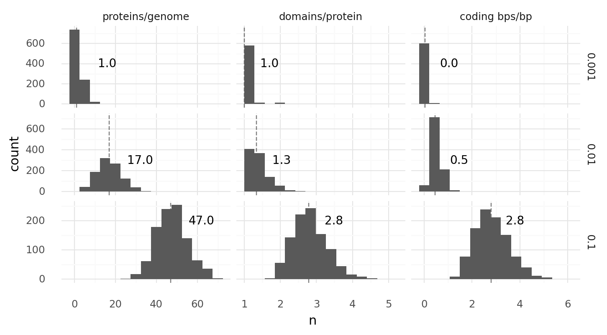

_**1.2. Genome compositions at different domain probabilities.**
1000 random genomes of length 1000 with 2 codon domain type frequencies 0.1%, 1%, or 10% each were generated, transcribed, and translated.
For every cell the number proteins per genome, domains per protein, and coding base pairs per base pair were recorded.
Coding base pairs are base pairs which are part of at least 1 domain.
Dashed lines with numbers describe medians.
There were 3 start and 3 stop codons._

 

_**1.3. Genome compositions at different start stop codon combinations.**
1000 random genomes of length 1000 with combinations of 1 to 3 start and 1 to 3 stop codons each were generated, transcribed, and translated.
For every cell the number proteins per genome, domains per protein, and coding base pairs per base pair were recorded.
Coding base pairs are base pairs which are part of at least 1 domain.
Dashed lines with numbers describe medians.
Facetting labels on the right describe first the number of start codons, second the number of stop codons.
Each domain type appeared with a frequency of 1% in all 2 codon tuples._

 

## 2. Transcriptomes

_**2.1. Transcriptome of a cell with a random genome of length 1000.**
Each CDS will be translated into a protein with all coupled domains.
The dark gray bar represents 5'-3' genome, light gray bars transcripts.
Transcripts above the genome are found on the genome in 5'-3' direction, below on the reverse-complement.
Colored bars represent domains on transcripts: transporer, catalytic, regulatory.
Transcripts and domains are aligned with their respective positions on the genome._

 

_**2.2. Transcriptome of a cell with a random genome of length 1000.**
Each CDS will be translated into a protein with all coupled domains.
The dark gray bar represents 5'-3' genome, light gray bars transcripts.
Transcripts above the genome are found on the genome in 5'-3' direction, below on the reverse-complement.
Colored bars represent domains on transcripts: transporer, catalytic, regulatory.
Transcripts and domains are aligned with their respective positions on the genome._

 

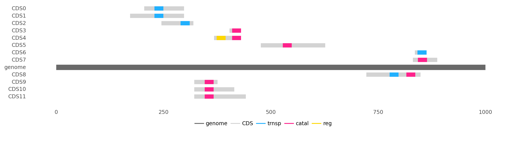

_**2.3. Transcriptome of a cell with a random genome of length 1000.**
Each CDS will be translated into a protein with all coupled domains.
The dark gray bar represents 5'-3' genome, light gray bars transcripts.
Transcripts above the genome are found on the genome in 5'-3' direction, below on the reverse-complement.
Colored bars represent domains on transcripts: transporer, catalytic, regulatory.
Transcripts and domains are aligned with their respective positions on the genome._

 

## 3. Mutations

_**3.1. Genomes diverge with random point mutations at different rates over time.**
Upper row shows percentage of cells which experienced at least 1 mutation.
Lower row shows similarity distributions of each cell to its unmutated genome.
Similarity is based on the normalized Levenshtein distance.
Rates are per base pair.
Each point mutation has a 40% chance of creating an indel, a random single base pair substitution otherwise.
Each indels indel has a 66.66% chance of being a deletion, a random single base pair insertion otherwise._

 

_**3.2. Genomes diverge with random recombinations at 30% confluency with different rates over time.**
Upper row shows percentage of cells which experienced at least 1 mutation.
Lower row shows similarity distributions of each cell to its unmutated genome.
Similarity is based on the normalized Levenshtein distance.
Recombination happens by creating random strand breaks in 2 genomes and randomly re-joining them.
Rates are random strand breakes per base pair.
Only neighbouring cells can recombinate their genomes._

 

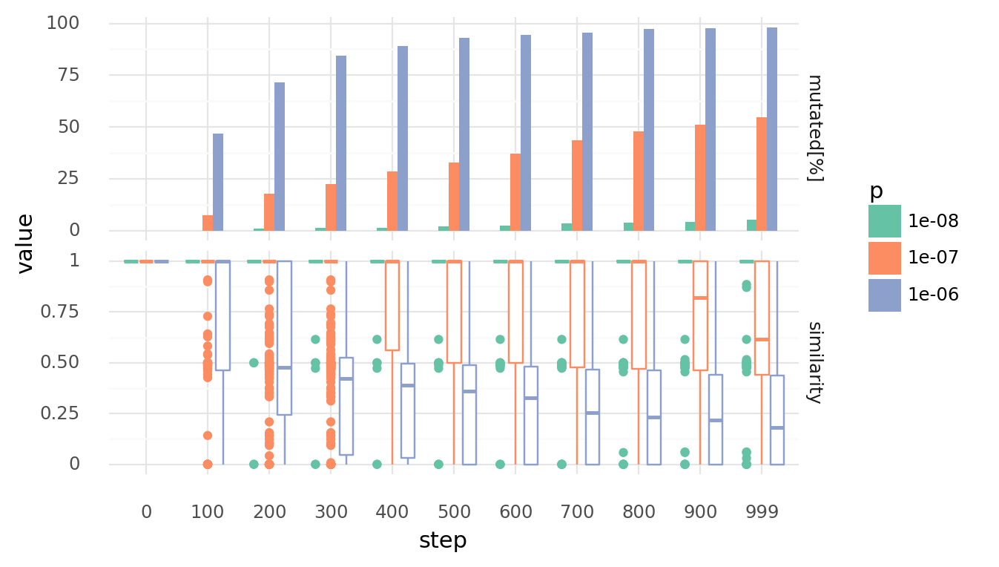

_**3.3. Genomes diverge with random recombinations at 50% confluency with different rates over time.**
Upper row shows percentage of cells which experienced at least 1 mutation.
Lower row shows similarity distributions of each cell to its unmutated genome.
Similarity is based on the normalized Levenshtein distance.
Recombination happens by creating random strand breaks in 2 genomes and randomly re-joining them.
Rates are random strand breakes per base pair.
Only neighbouring cells can recombinate their genomes._

 

## 4. Molecule Diffusion and Degradation

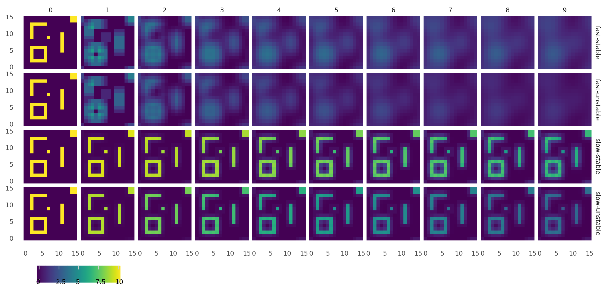

_**4.1. Molecule diffusion and degradation at different rates.**
Small world maps were customly filled with molecules and brought to diffuse and degrade over steps.
Columns from left to right show how each molecule map progressed from 0 to 9s.
Rows show molecule species with different properties: fast-diffusion and stable, fast-diffusing and unstable,
slow-diffusing and stable, slow-diffusing and unstable.
Fast-diffusing referse to a diffusivity of 1, slow-diffusing to a diffusivity of 0.01.
Stable refers to a half life of 1000, unstable to a half life of 10._

 

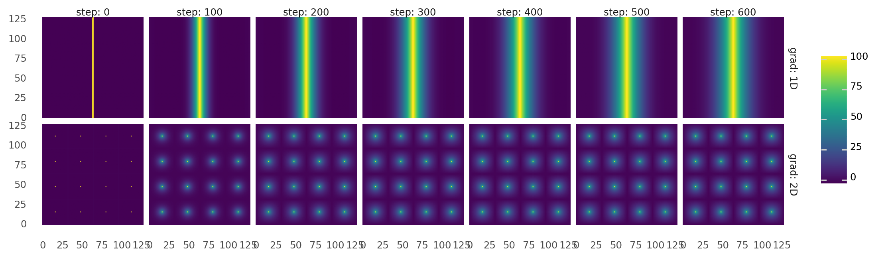

_**4.2. Molecule gradients are created.**
World maps are filled with molecules and brought to diffuse and degrade over time steps.
Columns from left to right show how each molecule map progressed over 600s.
Upper row shows a 1D gradient.
Lower row shows 2D gradients.
Gradients are created by selectively adding and removing molecules in certain positions.
1D gradient evolves by adding molecules in the middle of the map while removing it on the outskirts.
2D gradients evolve by adding molecules at 16 pixels while removing them on a grid between these pixels._

 

## 5. Equilibrium Constants

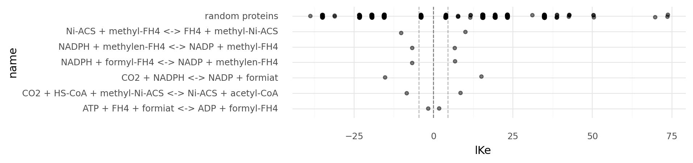

_**5.1. Equilibrium constant distributions of specific reactions on a logarithmic scale.**
Reaction energies are based on the molecule energies defined on the Wood-Ljungdahl example chemistry.
Random proteins describe enzymes based on 100 random genomes of length 500 using the Wood-Ljungdahl example chemistry.
Light dashed lines show 100 and 1/100 equilibrium constants, the dark dashed lined 0.
Reactions with equilibrium constants far beyong the light dashed lines become practically irreversible._

 

_**5.2. Molecule energies and temperatures influence equilibrium constant distributions.**
Absolute equilibrium constant distributions are shown on a logarithmic scale for random proteins
at different temperatures in Kelvin and different reaction energies.
Random proteins describe enzymes based on 1000 random genomes of length 500 using chemistries randomly generated.
These randomly generated chemistries have molecules with energies of 10 kJ, 100 kJ, or 200 kJ.
Light dashed line shows an equilibrium constant of 100, the dark dashed lined 0.
Reactions with equilibrium constants far beyong the light dashed line become practically irreversible._

 

## 6. Simple Reaction Kinetics

_**6.1. Molecule export over time with different parameters.**
Molecule concentrations inside and outside a cell are shown as molecules get transferred each step by
a single protein with a single transporter domain.
Rows show different Km values, columns different Vmax values for the protein._

 

_**6.2. Simple molecule catalysis over time with different parameters.**
Molecule concentrations inside a cell while it catalyzes 3A $\rightleftharpoons$ C | -10 kJ each step
by a single protein with a single catalytic domain.
Rows show different Km values, columns different Vmax values for the protein._

 

_**6.3. Simple molecule catalysis over time with different parameters.**
Molecule concentrations inside a cell while it catalyzes A + B $\rightleftharpoons$ C | 5 kJ each step
by a single protein with a single catalytic domain.
Rows show different Km values, columns different Vmax values for the protein._

 

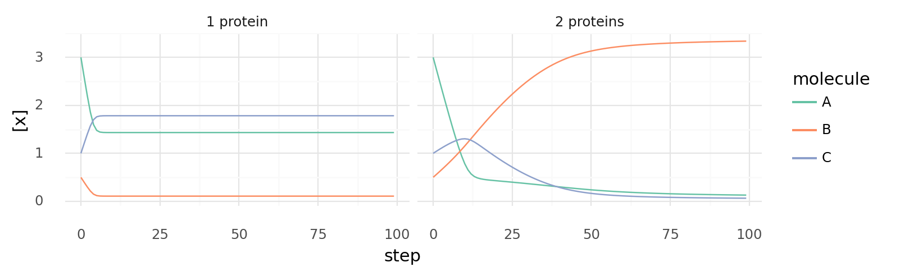

_**6.4. Uncoupled and coupled catalysis over time.**
Molecule concentrations inside a cell while it catalyzes 3A $\rightleftharpoons$ C | -10 kJ 
and A + B $\rightleftharpoons$ C | 5 kJ each step.
Left shows a cell with a single protein with 2 domains which are energetically coupled
as 4A + B $\rightleftharpoons$ 2C | -5 kJ.
Right shows a cell with 2 proteins with a single domain each for both reactions respectively._

 

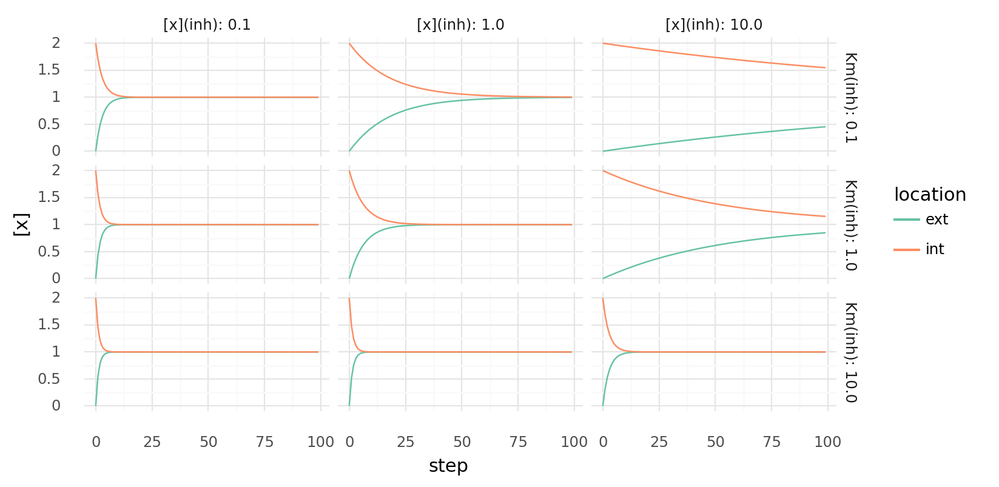

_**6.5. Inhibited molecule export over time with different parameters.**
Molecule concentrations inside and outside a cell are shown as molecules get transferred each step by
a single protein with a transporter domain and a inhibiting regulatory domain.
Rows show different Km values for the inhibitor, columns different inhibitor concentrations.
Transport has Vmax=1.0 and Km=1.0._

 

_**6.6. Inhibited molecule catalysis over time with different parameters.**
Molecule concentrations inside a cell while it catalyzes reactions each step
by 2 proteins with 2 domains each.
One protein catalyzes A + B $\rightleftharpoons$ C | 5 kJ and is inhibited by C,
the other catalyzes 3A $\rightleftharpoons$ C | -10 kJ and is inhibited by B.
Columns show different Km values for both inhibitors.
Catalytic domains have Vmax=0.3 and Km=1.0._

 

## 7. Biochemical Patterns

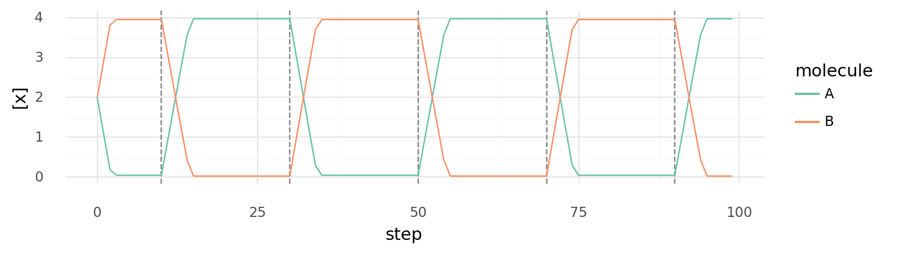

_**7.1. Switch with relay controlled by third molecule.**
Intracellular molecule A and B concentrations are shown while the abundance of a molecule C is changed.
Dashed vertical lines indicate when molecule C is alternatingly added or removed.
Cell has 2 proteins:
one catalyzing A + E $\rightleftharpoons$ B | -10 kJ inhibited by C,
one catalyzing B + E $\rightleftharpoons$ A | -10 kJ activated by C.
All Km and Vmax values are 1, intracellular C alternates between 0 and 4.
E is supplied each step._

 

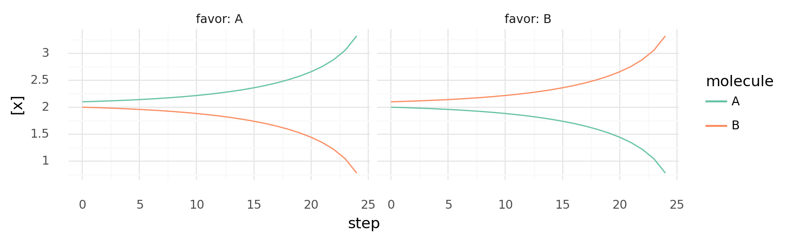

_**7.2. Self-activating enzymes create bistable switches.**
Intracellular A and B concentrations are shown over time.
Left shows a situation with A slightly higher than B, right shows the opposite.
Cell has 2 proteins:
one catalyzing A + E $\rightleftharpoons$ B | -100 kJ inhibited by A,
one catalyzing B + E $\rightleftharpoons$ A | -100 kJ inhibited by B.
All Km and Vmax values are 1, E is supplied each step._

 

_**7.3. Signal propagation through neighbouring cells with bistable switches based on self-activating enzymes.**
Intracellular A and B concentrations of 4 neighbouring cells are shown over time.
All cells have 2 proteins:
one catalyzing A + E $\rightleftharpoons$ B | -100 kJ inhibited by A,
one catalyzing B + E $\rightleftharpoons$ A | -100 kJ inhibited by B.
All Km and Vmax values are 1, E is supplied each step, A and B have permeability 0.1.
Slight concentration variations in one cell strengthen and propagate to other cells._

 

_**7.4. Simulated cyclic biochemical pathway.**
Intracellular molecule concentrations of cell with 4 proteins catalyzing
$A + E \rightleftharpoons B$ | -100 kJ, $B + E \rightleftharpoons C$ | -100 kJ,
$C + E \rightleftharpoons D$ | -100 kJ, and $D + E \rightleftharpoons A$ | -100 kJ.
Simulation starts with only intracellular A, E is supplied at each step._

 

## 8. Free Energy in Simulation

_**8.1. Energy and entropy density over time during simulation.**
Entropy (top) is the sum of all products of molecule concentration with its logarithm.
Energy (bottom) is the sum of all molecule energies at every position.
Simulations with only diffusion, only enzymatic activity, and both diffusion and enzymatic activity are shown.
Values were divided by number of pixel on map (per pixel).
Simulations were created with the example Wood-Ljungdahl chemistry and 50% cell confluency of cells with random genomes of length 1000._

 

## 9. Survival and Replication Rate

_**9.1. y over x for probability functions.**
Upper row shows $y = x^n / (x^n + k^n)$, lower row $y = k^n / (x^n + k^n)$.
Columns show different values for k, colors different values for n._

 

_**9.2. Probability of a cell dying or dividing at least once over time.**
The probability of dying or dividing depends on molecule concentrations x.
Left shows the probability of dying with $p_{die} = 1^7 / (x^7 + 1^7)$ each step,
right the probability of dividing with $p_{divide} = x^5 / (x^5 + 15^5)$ each step.
Colors show different molecule concentrations x._

 

_**9.3. Simulated cell growth at different molecule concentrations.**
Probability of each cell dying $p_{die}$ or dividing $p_{divide}$ at each step depends on molecule concentration x
with $p_{die} = 1^7 / (x^7 + 1^7)$ and $p_{divide} = x^5 / (x^5 + 15^5)$.
Simulated growth or decline of overall cell number over time is shown for cells with different concentrations x._

 

_**9.4. Simulated cell growth with multiple kill- or replicate-conditions.**
Simulated growth or decline of overall cell number over time
when there are multiple kill- (d) or replicate-conditions (r) as indicated by colors.
Probability of dying is calculated as $p_{die} = 1^7 / (x^7 + 1^7)$ at each step for each condition,
probability of dividing is calculated as $p_{divide} = x^5 / (x^5 + 15^5)$ at each step for each condition.
Concentration x is always 3.0 (centered 1k-1r)._

 

_**9.5. Example cell growth patterns.** In 4 simulations over 1000 steps with different kill and replication rates. (Left) with moderately high kill rate and low replicaiton rate.(Middle-left) with high replication rate and low kill rate. (Middle-right) with high replication and kill rate. (Right) with moderate kill and replication rate. Cell map is black, cells are white, every 5th step was captured._

 

## 10. Passaging

_**10.1. Selection by random passaging over time.**
Simulated cell growth of 4 cell lines with different growth rates.
Gray areas describe overall cell number at each step,
colored bars describe a passage with colors indicating relative cell line abundances
before the passage.
At each step a cell can divide or die depending on molecule concentration x
with probabilities $p_{divide} = x^5 / (x^5 + 15^5)$ and $p_{die} = 1^7 / (x^7 + 1^7)$ respectively.
Cell lines differ in their intracellular x concentrations as indicated by colors.
Passaging is always done randomly when total cell number reaches 7000.
Rows show different passaging ratios._

 

_**10.2. Selection by biased passaging over time.**
Simulated cell growth of 4 cell lines with different growth rates.
Gray areas describe overall cell number at each step,
colored bars describe a passage with colors indicating relative cell line abundances
before the passage.
At each step a cell can divide or die depending on molecule concentration x
with probabilities $p_{divide} = x^5 / (x^5 + 15^5)$ and $p_{die} = 1^7 / (x^7 + 1^7)$ respectively.
Cell lines differ in their intracellular x concentrations as indicated by colors.
Passaging is always done in a biased way with split ratio 0.2 when total cell number reaches 7000.
During passaging a bias factor increases the tendency to sample the same amount of cells of every cell line.
Rows show different values for this bias factor._

 

## 11. Kinetics Constants

_**11.1. Miachelis-Menten kinetics for multiple substrates.**
Plots show y over x with $y = V_{max} x^n / (x^n + K_m)$.
Parameters are always Vmax=1.0, Km=1.0, n=1 except for where they are varyied as indicated by colors._

 

_**11.2. Allosteric modulation with cooperativity over ligand concentration.**
Modulation is $y = x^h / (x^h + K_a)$ where h is the hill coefficient and K_a the ligand concentration
producing half occupation.
Top row shows negative cooperativity (-h), bottom row positive (h).
Columns show different values for K_a, colors different values for h._

 

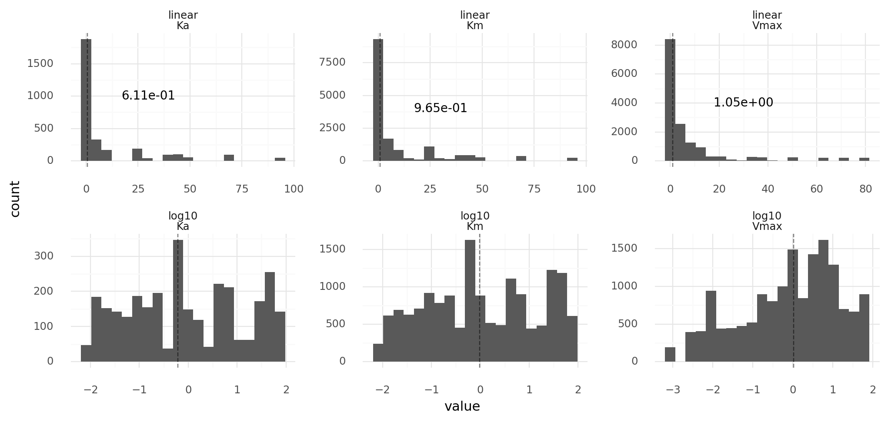

_**11.3. Vmax, Km, Ka distributions of randomly generated proteins.**
Upper row on linear scale, lower row on log10 scale.
Proteins are from 1000 cells with random genomes of length 1000 each.
Reaction kinetics have a Km range of 0.01 to 100 and a Vmax range of 0.001 to 100.
Dashed lines with text describe medians._

 