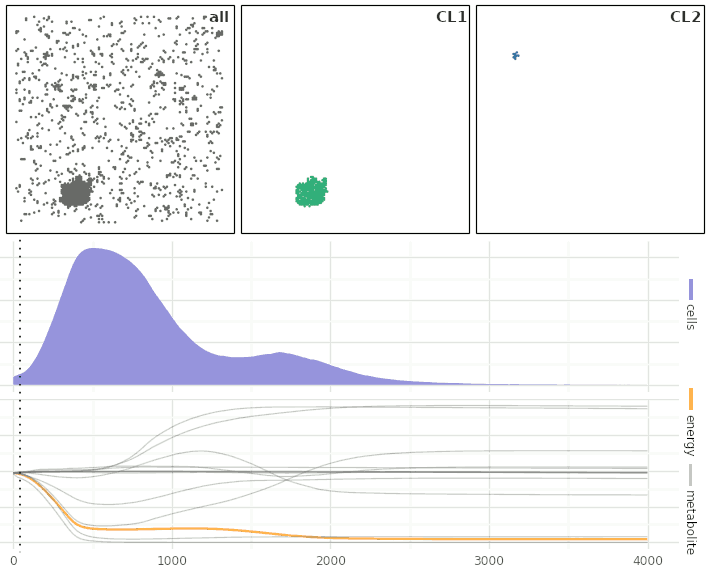

# Magicsoup

---

**Documentation**: [https://magic-soup.readthedocs.io/](https://magic-soup.readthedocs.io/)

**Source Code**: [https://github.com/mRcSchwering/magic-soup](https://github.com/mRcSchwering/magic-soup)

**PyPI**: [https://pypi.org/project/magicsoup/](https://pypi.org/project/magicsoup/)

---

This game simulates cell metabolic and transduction pathway evolution.
Define a 2D world with certain molecules and reactions.
Add a few cells and create evolutionary pressure by selectively replicating and killing them.
Then run and see what random mutations can do.



_Cell growth of 1000 cells with different genomes was simulated. Top row: Cell maps showing all cells (left), cellline 1 (middle), and cellline 2 (right). Celline 1 was the fastest growing cell line at high energy levels, celline 2 at low energy levels. Middle and bottom rows: Development of total cell count and molecule concentrations over time._

Proteins in this simulation are made up of catalytic, transporter, and regulatory domains.
They are energetically coupled within the same protein and mostly follow Michaelis-Menten-Kinetics.
Chemical reactions and molecule transport only ever happens in the energetically favourable direction, as defined by the Nernst equation.
With enough proteins a cell is able to create complex networks with cascades, feed-back loops, and oscillators.
Through these networks a cell is able to communicate with its environment and form relationships with other cells.
How many proteins a cell has, what domains they have, and how these domains are parametrized is all defined by its genome.
Through random mutations cells search this vast space of possible proteomes.
By allowing only certain proteomes to replicate, this search can be guided towards a specific goal.

## Example

The basic building blocks of what a cell can do are defined by the world's chemistry.
There are molecules and reactions that can convert these molecules.
Cells can develop proteins with domains that can transport these molecules,
catalyze the reactions, and be regulated by molecules.
Any reaction or transport happens only if energetically favourable.
Below, I am defining the reaction $CO2 + NADPH \rightleftharpoons formiat + NADP$.
Each molecule species is defined with a energy.

```python
import torch
import magicsoup as ms

NADPH = ms.Molecule("NADPH", 200 * 1e3)
NADP = ms.Molecule("NADP", 100 * 1e3)
formiat = ms.Molecule("formiat", 20 * 1e3)
co2 = ms.Molecule("CO2", 10 * 1e3)

molecules = [NADPH, NADP, formiat, co2]
reactions = [([co2, NADPH], [formiat, NADP])]

chemistry = ms.Chemistry(reactions=reactions, molecules=molecules)
world = ms.World(chemistry=chemistry)
```

By coupling multiple domains within the same protein, energetically unfavourable actions
can be powered with the energy of energetically favourable ones.
These domains, their specifications, and how they are coupled in proteins, is all encoded in the cell's genome.
Here, I am generating 100 cells with random genomes of 500 basepairs each and place them
in random places on the 2D world map.

```python
genomes = [ms.random_genome(s=500) for _ in range(100)]
world.spawn_cells(genomes=genomes)
```

Cells discover new proteins by chance through mutations.
In the function below all cells experience 1E-3 random point mutations per nucleotide.
10% of them will be indels.

```python
def mutate_cells(world: ms.World):
    mutated = ms.point_mutations(seqs=world.cell_genomes)
    world.update_cells(genome_idx_pairs=mutated)
```

Evolutionary pressure can be applied by selectively killing or replicating cells.
Here, cells have an increased chance of dying when formiat gets too low
and an increased chance of replicating when formiat gets high.

```python
def sample(p: torch.Tensor) -> list[int]:
    idxs = torch.argwhere(torch.bernoulli(p))
    return idxs.flatten().tolist()

def kill_cells(world: ms.World):
    x = world.cell_molecules[:, 2]
    idxs = sample(.01 / (.01 + x))
    world.kill_cells(cell_idxs=idxs)

def replicate_cells(world: ms.World):
    x = world.cell_molecules[:, 2]
    idxs = sample(x ** 3 / (x ** 3 + 20.0 ** 3))
    world.divide_cells(cellc_idxs=idxs)
```

Finally, the simulation itself is run in a python loop by repetitively calling the different steps.
With `world.enzymatic_activity()` chemical reactions and molecule transport
in cells advance by one time step.
`world.diffuse_molecules()` lets molecules on the world map diffuse and permeate through cell membranes
(if they can) by one time step.

```python
for _ in range(1000):
    world.enzymatic_activity()
    kill_cells(world=world)
    replicate_cells(world=world)
    mutate_cells(world=world)
    world.diffuse_molecules()
    world.increment_cell_lifetimes()
```

## Concepts

In general, you create a [Chemistry][magicsoup.containers.Chemistry] object with reactions and molecule species.
For molecules you can define things like energy, permeability, diffusivity.
See the [Molecule][magicsoup.containers.Molecule] class for more info.
Reactions are just tuples of substrate and product molecule species.

Then, you create a [World][magicsoup.world.World] object which defines things like a cell and molecule maps.
It carries all data describing the world at this time step with cells, molecule distributions and so on.
On this object there are also methods used to advance the world by one time step.
By default molecule numbers are in mM, energies are in J/mol, and a time step represents 1s.

Usually, you would only adjust `Molecule`s and `World`.
However, in some cases you might want to change the way how genetics work;
_e.g._ change the way how certain domains are encoded, or change how coding regions are defined.
In that case you can override the default [Genetics][magicsoup.genetics.Genetics] object.

Apart from that, you create the simulation to your own likings.
From the `World` object you can observe molecule contents in cells
and use that this information to kill or replicate them (like in the example above).
You can also alter parts of the world, like creating concentration gradients
or regularly supplying the world with certain molecules/energy.
The documentation of [World][magicsoup.world.World] describes all attributes that could be of interest.

All major work is done using [PyTorch](https://pytorch.org/) and can be moved to a GPU.
`World` has an argument `device` to control that.
Please see [CUDA semantics](https://pytorch.org/docs/stable/notes/cuda.html) on how to use it.
And since this simulation already requires [PyTorch](https://pytorch.org/), it makes sense
to use [TensorBoard](https://pytorch.org/docs/stable/tensorboard.html) to interactively monitor your ongoing simulation.

## Installation

For CPU alone you can just do:

```bash
pip install magicsoup
```

This simulation relies on [PyTorch](https://pytorch.org/).
You can move almost all calculations to a GPU.
To setup pytorch correctly for your GPU see [Get Started (pytorch.org)](https://pytorch.org/get-started/locally/).
