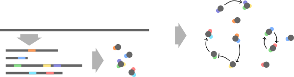

# Mechanics

The simulation is an agent-based 2D spatio-temporal simulation.
Cells are agents. Each cell has a string, the genome, which unambigously encodes a set or proteins, the proteome.
These proteins can change molecules in and around the cell.
Through that each cell can process information.
Each cell's proteome can form complex networks with hubs, feedback loops, cascades, and oscillators.
When randomly changing the cell's genome, this network changes randomly, too.
By selectively replicating certain cells while killing others, cells can evolve.

- [Genetics](#genetics) explains how genetics work in this simulation
- [Chemistry](#chemistry) explanation for molecules, reactions and energy coupling
- [Kinetics](#kintics) explain the reaction kinetics in this simulation
- [Implementation](#implementation) some implementation details worth mentioning

I believe that most interesting behaviors take many time steps to evolve.
That's why this simulation is implemented with millions of time steps in mind.
Genetics, chemistry, physics in this simulation is simplified a lot.
It is a tradeoff between a reasonable amount of complexity and performance.

## Genetics

All mechanisms are based on bacterial [transcription](<https://en.wikipedia.org/wiki/Transcription_(biology)>)
and [translation](<https://en.wikipedia.org/wiki/Translation_(biology)>).
A cell's [genome](https://en.wikipedia.org/wiki/Genome) is a chain of [nucleotides](https://en.wikipedia.org/wiki/Nucleotide) represented by a string of letters
T, C, G, A. There are [start and stop codons](https://en.wikipedia.org/wiki/Genetic_code) which define [coding regions (CDSs)](https://en.wikipedia.org/wiki/Coding_region).
Transcription can start at any start codon and will end when the first [in-frame](https://en.wikipedia.org/wiki/Reading_frame) stop codon encountered.
CDSs without stop codon are not considered [[James NR 2016](https://pubmed.ncbi.nlm.nih.gov/27934701/)].
Each CDS will then be translated into one protein, giving each cell a certain [proteome](https://en.wikipedia.org/wiki/Proteome).
What each protein can do is defined by its [domains](https://en.wikipedia.org/wiki/Protein_domain).

_A cells genome is transcribed into multiple coding regions, each of which forms a protein. Each coding region can contain multiple domains of which each has a different purpose and different kinetics. Together these proteins form signal processing networks in the cell._

Currently, there are three domain types: _catalytic, transporter, regulatory_.
Each domain consists of a region of genetic code that defines the domain type itself
and several regions that define its further specifications.
What these specifications are depends on the domain type.

_Catalytic_ domains can catalyze one reaction.
All possible reactions are defined in the simulation's chemistry (see [Chemistry](#chemistry)).
Specifications are the catalyzed reaction, affinities for substrates and products,
maximum velocity, domain orientation (see [Energy](#energy)).

_Transporter_ domains can move a molecule species across the cell membrane,
_i.e._ from the outside world into the cell and _vice versa_.
All possible molecule species are defined in the simulation's chemistry (see [Chemistry](#chemistry)).
Specifications are the molecule species, molecule affinity, maximum velocity, domain orientation (see [Energy](#energy)).

_Regulatory_ domains can regulate a protein through an effector molecule.
A protein with only a regulatory domain has no function.
But if the protein also has a catalytic or transporter domain, the regulatory
domain can up- or down-regulate this domain.
Specifications are the effector molecule species, whether it is an activating or inhibiting
effector, the affinity to that effector.

Affinity and maximum velocity are kinetic parameters which are described in [Kinetics](#kinetics) in more detail.
Which specific combination of nucleotides encodes which specific parameter, _e.g._ a particular maximum velocity value,
is defined by mappings.
These mapping are created when the [Genetics][magicsoup.genetics.Genetics] object is initialized.
A user can also override them later on.
For more details see the [Genetics][magicsoup.genetics.Genetics] class.

The rules of this genetic setup are quite simple.
_E.g._ there is no transcriptional and post-transcriptional regulation.
Abundance, location, and efficiency of CDSs are not taken into consideration.
Yet still this simple genetic setup can already create complex protein networks
with hubs, feedback loops, oscillators, and cascades.

## Chemistry

As the basis of this simulation one has to define which molecule species exist
and which reactions are possible.
Molecule species are defined with attributes about how fast they can diffuse
and permeate, and with an internal energy value.
This energy is the hypothetical energy that this molecule would release if it was fully deconstructed.
Reactions define how molecule species can converted.
They are all reversible (see [Kinetics](#kinetics) for details).
Here, the simulation takes [Gibbs free energy](https://en.wikipedia.org/wiki/Gibbs_free_energy) as an analogy:

$$
\Delta G_0 = \sum^{products}{E_{P,j}^{n_j}} - \sum^{substrates}{E_{S,i}^{n_i}}
$$

where $\Delta G_0$ is the standard Gibbs free energy of the reaction,
$E_{S,i}$ is the energy of substrate $i$ with stoichiometric coefficient $n_i$,
and $E_{P,j}$ is the energy of product $j$ with stoichiometric coefficient $n_j$.
It is used to calculate an [equilibrium constant](https://en.wikipedia.org/wiki/Equilibrium_constant)
$K_e$ for this reaction.

$$
\frac{-\Delta G_0}{RT} = \ln K_e
$$

where $R$ is the [gas constant](https://en.wikipedia.org/wiki/Gas_constant) and $T$ is the absolute temperature.
As further described in [Kinetics](#kinetics) the [reaction quotient](https://en.wikipedia.org/wiki/Reaction_quotient) $Q$
always moves towards $K_e$.
So, reactions tend to be favourable into the direction which deconstructs high energy molecules
and constructs low energy molecules.

However, all reactions catalyzed by the same protein are considered to be energetically coupled.
All domains are considered when calculating $\Delta G_0$.
Thus, an energetically unfavourable reaction can progress if it is powered by an energetically favourable one.
In which orientation these domains are energetically coupled
is defined in the domain itself as a region that encodes a boolean $\{0;1\}$.
All domains with orientation $0$ work from left to right, and _vice versa_ for $1$.
_E.g._ if there are 2 catalytic domains $A \rightleftharpoons B$ and $C \rightleftharpoons D$,
they would become $A + C \rightleftharpoons B + D$ if they have the same orientation,
and $A + D \rightleftharpoons B + C$ if not.

Transporter domains are also involved this way.
A transporter is seen as a reaction that converts an intracellular molecule to its extracellular version (and _vice versa_).
For a transporter $\Delta G_0$ is always zero only $Q$ drives the reaction.
Thus, a transporter can drive a reaction while molecules are allowed to diffuse along
their concentration gradient, or a reaction might drive a transporter to pump molecules
against their concentration gratient.

## Kinetics

All reactions in this simulation are based on [Michaelis-Menten-Kinetics](https://en.wikipedia.org/wiki/Michaelis%E2%80%93Menten_kinetics).
However, the possibility of a reverse reaction is allowed on the second step.
In the simplest case enzyme (E) forms a complex (ES) with substrate (S) and modifies it to product (P).
P can bind E again and react back to S.

$$
\text{E} + \text{S} \overset{k_1}{\underset{k_{-1}}{\rightleftharpoons}} \text{ES}
\overset{k_2}{\underset{k_{-2}}{\rightleftharpoons}} \text{E} + \text{P}
$$

Where $k_1$, $k_{-1}$, $k_2$, $k_{-2}$ are the forward and reverse rates for the first and second step.
This can be described with the reversible Michaelis-Menten equation

$$
v = \frac{d[P]}{dt} =
\frac{v_{max,f} \frac{[S]}{K_{m,1}} - v_{max,b} \frac{[P]}{K_{m,2}}}{1 + \frac{[S]}{K_{m,1}} + \frac{[P]}{K_{m,2}}}
$$

with

\begin{aligned}
v_{max,f} &= k_2 [E_{total}]      && K_{m,1} = \frac{k_{-1} + k_2}{k_1}    \\
v_{max,b} &= k_{-1} [E_{total}]   && K_{m,2} = \frac{k_{-1} + k_2}{k_{-2}}
\end{aligned}

where velocity $v$ is the change in $[P]$ over time,
$[E_{total}]$ is the concentration of total enzyme ($E$ and $ES$),
$[S]$ is the substrate concentration,
$[P]$ is the product concentration.

In the simulation S and P can be molecules, and the enzyme is a protein with some functional domains.
For simplification $[E_{total}]$ is assumed to be constant for all cells and proteins,
and $v_{max,f} = v_{max,b} = v_{max}$.
The reversible Michaelis-Menten equation can then be re-written as

$$
v = \frac{d[P]}{dt} =
v_{max} \frac{\frac{[S]}{K_{m,1}} - \frac{[P]}{K_{m,2}}}{1 + \frac{[S]}{K_{m,1}} + \frac{[P]}{K_{m,2}}}
$$

$v_{max}$ defines the maximum velocity of the protein.
$K_{m,1}$ and $K_{m,2}$ describe reciprocal affinities to S and P.
In general a protein can consist of catalytic, transporter, and regulatory domains (see [Genetics](#genetics)).
Transporters are treated as catalytic domains which convert a molecule species from its intracellular version to its extracellular one and _vice versa_.
Regulatory domains regulate the protein [non-competitively](https://en.wikipedia.org/wiki/Non-competitive_inhibition).
The final velocity of a protein is

$$
v_{final} = a_{reg} v_{max} \frac{X_S - X_P}{1 + X_S + X_P}
$$

with

$$
X_S = 
\frac{1}{K_{m,1}} \prod^{\text{substrates}} [S]_i^{n_i}
\text{  ,  }
X_P = \frac{1}{K_{m,2}} \prod^{\text{products}} [P]_j^{n_j}
$$

where $a_{reg} \in [0;1]$ is regulatory activity (details below),
$[S]_i$ is the concentration of substrate $i$ with stoichiometric coefficient $n_i$,
and $[P]_j$ is the concentration of product $j$ with stoichiometric coefficient $n_j$.
Concentration change over time of any molecule species can be calculated by multiplying its 
[stoichiometric number](https://en.wikipedia.org/wiki/Stoichiometry#Stoichiometric_coefficient_and_stoichiometric_number)
(using IUPAC nomenclatur) with $v_{final}$.
Over time the reaction will approach an equilibrium state
where $v_{final} = 0$, and its [reaction quotient](https://en.wikipedia.org/wiki/Reaction_quotient) 
$Q = K_e$ (the [equilibirum constant](https://en.wikipedia.org/wiki/Equilibrium_constant)):

$$
\lim_{t \to \infty} Q = \frac{X_P}{X_S} = \frac{K_{m,1}}{K_{m,2}} = K_e
$$

Thus, $K_e = \frac{K_{m,1}}{K_{m,2}}$ defines in which direction the reaction will proceed.
As described in [Chemistry](#chemistry) $K_e$ is calculated from an analogy of the reaction's Gibbs free energy.
Actual values for $v_{max}$, $K_{m,1}$, $K_{m,2}$ are derived from the domain specifications (see [Genetics](#genetics)).
One part of of the domain specification encodes maximum velocity $v_{max}$.
Another part encodes affinity $K_m$ from which $K_{m,1}$ and $K_{m,2}$ are derived.

\[
K_{m,1} =
\begin{cases}
K_m,             & \text{if $K_e \ge 1$} \\
\frac{K_m}{K_e}, & \text{if $K_e < 1$}
\end{cases}
\text{  ,  }
K_{m,2} =
\begin{cases}
K_e K_m,  & \text{if $K_e \ge 1$} \\
K_m,      & \text{if $K_e < 1$}
\end{cases}
\]

Regulatory activity $a_{reg}$ with inhibiting effector molecules (inhibitors) I
and activating effector molecules (activators) A is modeled as

$$
a_{reg} = a_{act} (1 - a_{inh}) = \frac{X_A}{K_{m,a} + X_A} (1 - \frac{X_I}{K_{m,i} + X_I})
$$

with

$$
X_A = \prod^{\text{activators}} [A]_l^{n_l} \text{  ,  }  X_I = \prod^{\text{inhibitors}} [I]_k^{n_k}
$$

where $K_{m,a}$ defines the reciprocal affinity of activators,
$K_{m,i}$ defines the reciprocal affinity of inhibitors,
$[A]_l$ is the concentration of activator $l$ with stoichiometric coefficient $n_l$,
and $[I]_k$ is the concentration of inhibitor $k$ with stoichiometric coefficient $n_k$.
If there are no activators $a_{act} = 1$ and if there are no inhibitors $a_{inh} = 0$.
Values for $K_{m,a}$ and $K_{m,i}$ are directly defined in the domain specifications.

When values for the mappings of nucleotide sequences to values for maximum velocities and affinities
are created, they are sampled from a log-uniform distribution with user defined boundaries.
If there are multiple catalytic and transporter domains,
activating regulatory domains, or inhibiting regulatory domains
values for $v_{max}$, $K_m$, $K_{m,a}$, $K_{m,i}$ are averaged each.

## Implementation

Making the simulation more performant is an oingoing effort.
I want to get the frequency up to a thousand time steps per second for a simulation with around 100k cells.
Currently, the simulation leans on [PyTorch](https://pytorch.org/) to do that.
Most operations are expressed as pytorch operations and can be moved to a GPU.
However, there are still parts which are calculated in plain python.
As of now, these are the operations concerned with creating/mutating genomes, transcription and translation.
These parts are usually the performance bottlenecks.

### N Computations

...

### Low molecule abundances

Changes in molecule abundances are calculated for every step based on protein velocities.
These protein velocities depend in one part on substrate abundances
(as desribed in [Kinetics](#kinetics)).
Thus, generally as substrate abundances decrease, protein velocities decrease.
And so, deconstruction rates of this molecule species decrease.
Furthermore, the reaction quotient moves further in a direction that benefits the reverse reaction.
So, generally proteins shouldn't attempt to deconstruct more substrate than possible.
However, if a protein has a very high $v_{max}$ and a very low $K_m$ it can happen that
during one step it would deconstruct more substrate than actually available.
This can also happen if multiple proteins in the same cell would deconstruct the same molecule species.
The trick above with multiple computations should avoid that, but it is not 100% garanteed.

To avoid deconstructing more substrate than available and creating negative molecule abundances there is a safety mechanism.
First, the naive protein velocities $v_{final}$ are calculated and compared with substrate abundances.
If some $v_{final}$ attempts to deconstruct more substrate than available, it is reduced to
by a factor to leave almost zero substrates (a small constant $\varepsilon > 0$ is kept).
All protein velocities in the same cell are reduced by the same factor.
This is because of possible dependencies between proteins.

Say, protein P0 tried to do $A \rightleftharpoons B$ with $v_{final,P0} = 2$, but only 1 of A was available.
At the same time another protein P1 in the same cell does $B \rightleftharpoons C$ with $v_{final,P1} = 2$, with 0.5 of B available.
In the naive calculation P1 would be valid because P0 would create 2 B and so P1 can legitimately deconstruct 2 B.
However, after the naive calculation P0 is slowed down with a factor of almost 0.5, which means
it now deconstructs almost 1 A and synthesizes almost 1 B.
Now, P1 became a downstream problem of reducing P0, as it doesn't have enough B.
To avoid calculating a dependency tree during each step for each cell, all proteins are slowed down by the same factor.

Note, lazyly limiting all molecule abundances to a minimum of 0 (_e.g._ `X.clamp(0.0)`) is also not an option.
This would mean a cell could deconstruct only 1 A while gaining 2 B.
It would create molecules and energy from nothing.
See [integrate_signals][magicsoup.kinetics.Kinetics.integrate_signals] for more information.
