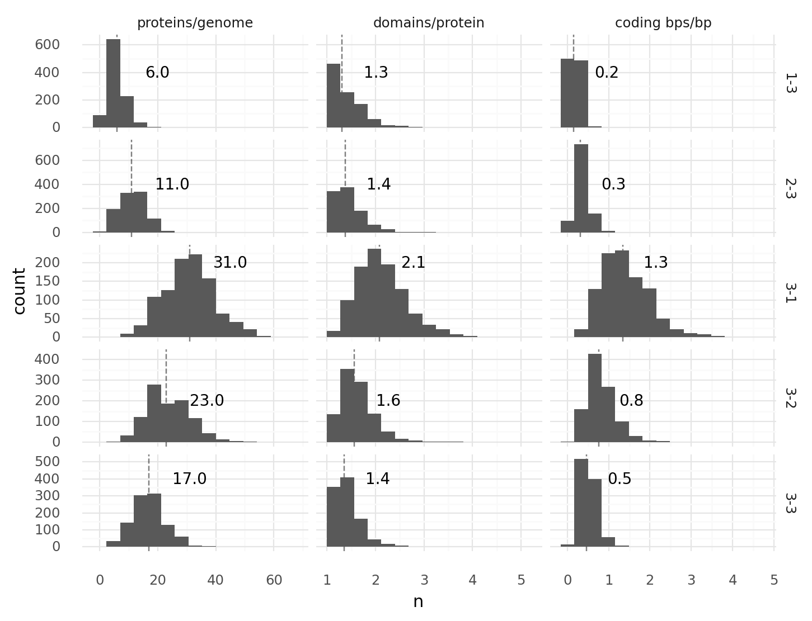
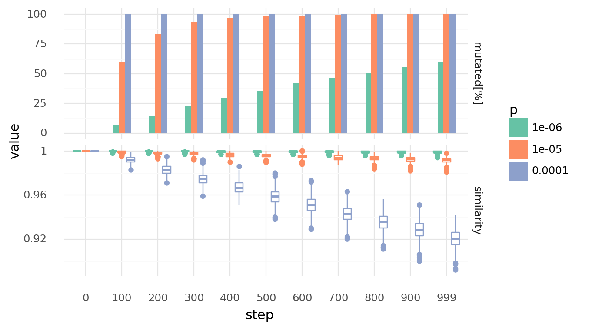
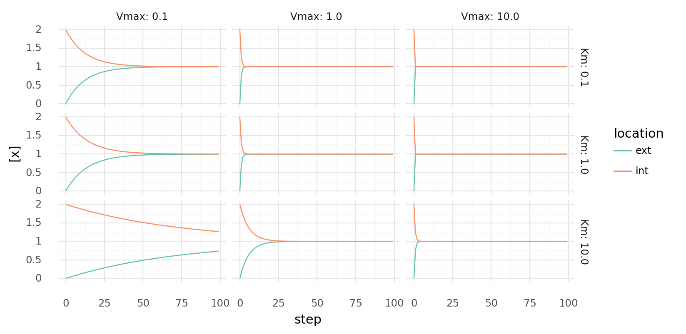
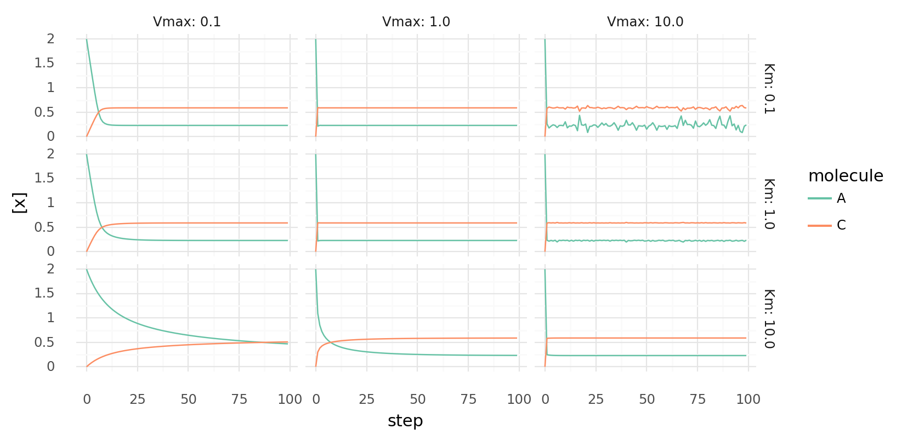
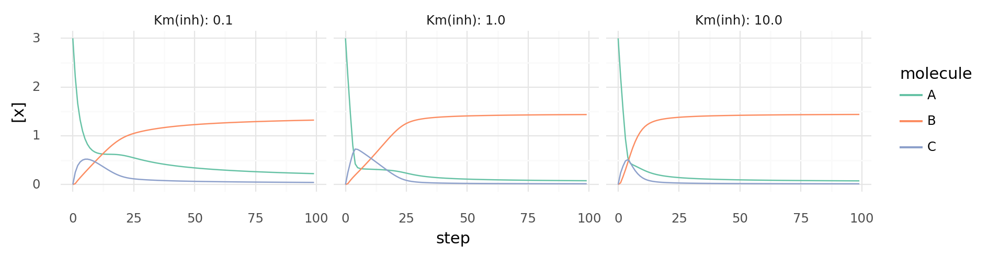
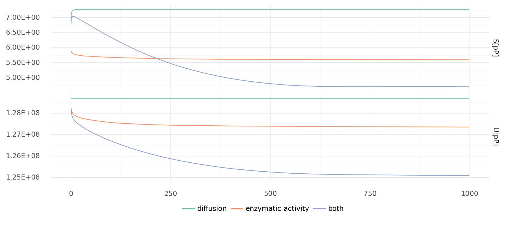
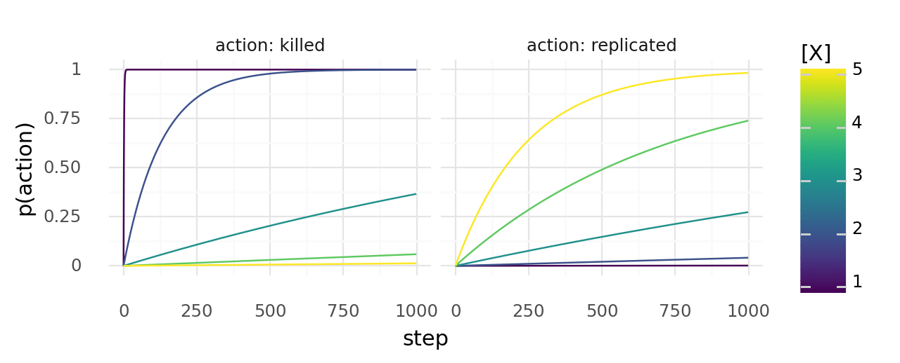
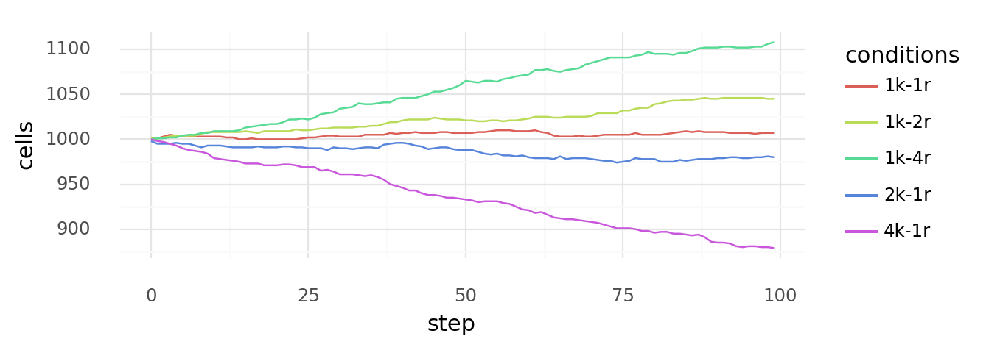
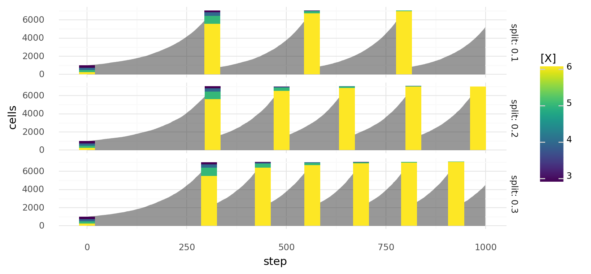
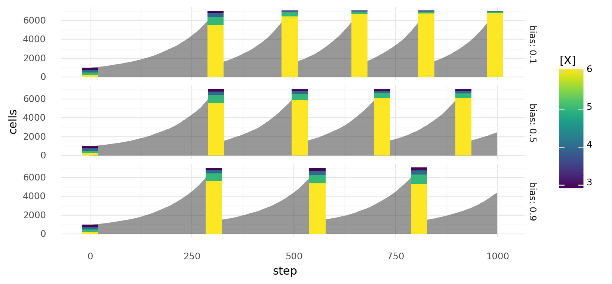

# Supporting Figures

## Genomes

_Genome compositions at different genome sizes.
1000 random genomes of lengths 200, 500, 1000, or 2000 each were generated, transcribed, and translated.
For every cell the number proteins per genome, domains per protein, and coding nucleotides per nucleotide were recorded.
Coding nucleotides are nucleotides which are part of at least 1 domain.
Dashed lines with numbers describe medians.
There were 3 start and 3 stop codons.
Each domain type appeared with a frequency of 10% in all 2 codon tuples._

_Genome compositions at different domain probabilities.
1000 random genomes of length 1000 with 2 codon domain type frequencies 0.1%, 1%, or 10% each were generated, transcribed, and translated.
For every cell the number proteins per genome, domains per protein, and coding nucleotides per nucleotide were recorded.
Coding nucleotides are nucleotides which are part of at least 1 domain.
Dashed lines with numbers describe medians.
There were 3 start and 3 stop codons._

_Genome compositions at different start stop codon combinations.
1000 random genomes of length 1000 with combinations of 1 to 3 start and 1 to 3 stop codons each were generated, transcribed, and translated.
For every cell the number proteins per genome, domains per protein, and coding nucleotides per nucleotide were recorded.
Coding nucleotides are nucleotides which are part of at least 1 domain.
Dashed lines with numbers describe medians.
Facetting labels on the right describe first the number of start codons, second the number of stop codons.
Each domain type appeared with a frequency of 10% in all 2 codon tuples._

## Transcriptomes

_Transcriptome of a cell with a random genome of length 1000.
Each CDS will be translated into a protein with all coupled domains.
The dark gray bar represents 5'-3' genome, light gray bars transcripts.
Transcripts above the genome are found on the genome in 5'-3' direction, below on the reverse-complement.
Colored bars represent domains on transcripts: transporer, catalytic, regulatory.
Transcripts and domains are aligned with their respective positions on the genome._

_Transcriptome of a cell with a random genome of length 1000.
Each CDS will be translated into a protein with all coupled domains.
The dark gray bar represents 5'-3' genome, light gray bars transcripts.
Transcripts above the genome are found on the genome in 5'-3' direction, below on the reverse-complement.
Colored bars represent domains on transcripts: transporer, catalytic, regulatory.
Transcripts and domains are aligned with their respective positions on the genome._

_Transcriptome of a cell with a random genome of length 1000.
Each CDS will be translated into a protein with all coupled domains.
The dark gray bar represents 5'-3' genome, light gray bars transcripts.
Transcripts above the genome are found on the genome in 5'-3' direction, below on the reverse-complement.
Colored bars represent domains on transcripts: transporer, catalytic, regulatory.
Transcripts and domains are aligned with their respective positions on the genome._

## Mutations

_Genomes diverge with random point mutations at different rates over time.
Upper row shows percentage of cells which experienced at least 1 mutation.
Lower row shows similarity distributions of each cell to its unmutated genome.
Similarity is based on the normalized Levenshtein distance.
Rates are per nucleotide.
Each point mutation has a 40% chance of creating an indel, a random single nucleotide substitution otherwise.
Each indels indel has a 66.66% chance of being a deletion, a random single nucleotide insertion otherwise._

_Neighbouring cells per cell with increasing cell coverage.
Only unique neighbour pairs are counted.
So, the maximum number of neighbours per cell at 100% coverage is 4._

_Genomes diverge with random recombinations at different rates over time.
Upper row shows percentage of cells which experienced at least 1 mutation.
Lower row shows similarity distributions of each cell to its unmutated genome.
Values at 30% cell coverage are in the left column, at 50% coverage in the right column.
Similarity is based on the normalized Levenshtein distance.
Recombination happens by creating random strand breaks in 2 genomes and randomly re-joining them.
Rates are random strand breakes per nucleotide.
Only neighbouring cells can recombinate their genomes._

## Molecule Diffusion and Degradation

_Molecule diffusion and degradation at different rates.
Small world maps were customly filled with molecules and brought to diffuse and degrade over steps.
Columns from left to right show how each molecule map progressed from 0 to 9s.
Rows show molecule species with different properties: fast-diffusion and stable, fast-diffusing and unstable,
slow-diffusing and stable, slow-diffusing and unstable.
Fast-diffusing referse to a diffusivity of 1, slow-diffusing to a diffusivity of 0.01.
Stable refers to a half life of 1000, unstable to a half life of 10._

_Molecule gradients are created.
World maps are filled with molecules and brought to diffuse and degrade over time steps.
Columns from left to right show how each molecule map progressed over 600s.
Upper row shows a 1D gradient.
Lower row shows 2D gradients.
Gradients are created by selectively adding and removing molecules in certain positions.
1D gradient evolves by adding molecules in the middle of the map while removing it on the outskirts.
2D gradients evolve by adding molecules at 16 pixels while removing them on a grid between these pixels._

## Equilibrium Constants

_Equilibrium constant distributions of specific reactions on a logarithmic scale.
Reaction energies are based on the molecule energies defined on the Wood-Ljungdahl example chemistry.
Random proteins describe enzymes based on 100 random genomes of length 500 using the Wood-Ljungdahl example chemistry.
Light dashed lines show 100 and 1/100 equilibrium constants, the dark dashed lined 0.
Reactions with equilibrium constants far beyong the light dashed lines become practically irreversible._

_Molecule energies and temperatures influence equilibrium constant distributions.
Absolute equilibrium constant distributions are shown on a logarithmic scale for random proteins
at different temperatures in Kelvin and different reaction energies.
Random proteins describe enzymes based on 1000 random genomes of length 500 using chemistries randomly generated.
These randomly generated chemistries have molecules with energies of 10 kJ, 100 kJ, or 200 kJ.
Light dashed line shows an equilibrium constant of 100, the dark dashed lined 0.
Reactions with equilibrium constants far beyong the light dashed line become practically irreversible._

## Vmax and Km Distributions

_Vmax and Km distributions of randomly generated proteins.
Proteins are from 1000 cells with random genomes of length 1000 each.
Reaction kinetics have a Km range of 0.01 to 100 and a Vmax range of 0.001 to 100.
Dashed lines with text describe medians._

## Simple Reaction Kinetics

_Molecule export over time with different parameters.
Molecule concentrations inside and outside a cell are shown as molecules get transferred each step by
a single protein with a single transporter domain.
Rows show different Km values, columns different Vmax values for the protein._

_Simple molecule catalysis over time with different parameters.
Molecule concentrations inside a cell while it catalyzes 3A $\rightleftharpoons$ C | -10 kJ each step
by a single protein with a single catalytic domain.
Rows show different Km values, columns different Vmax values for the protein._

_Simple molecule catalysis over time with different parameters.
Molecule concentrations inside a cell while it catalyzes A + B $\rightleftharpoons$ C | 5 kJ each step
by a single protein with a single catalytic domain.
Rows show different Km values, columns different Vmax values for the protein._

_Uncoupled and coupled catalysis over time.
Molecule concentrations inside a cell while it catalyzes 3A $\rightleftharpoons$ C | -10 kJ 
and A + B $\rightleftharpoons$ C | 5 kJ each step.
Left shows a cell with a single protein with 2 domains which are energetically coupled
as 4A + B $\rightleftharpoons$ 2C | -5 kJ .
Right shows a cell with 2 proteins with a single domain each for both reactions respectively.

_Inhibited molecule export over time with different parameters.
Molecule concentrations inside and outside a cell are shown as molecules get transferred each step by
a single protein with a transporter domain and a inhibiting regulatory domain.
Rows show different Km values for the inhibitor, columns different inhibitor concentrations.
Transport has Vmax=1.0 and Km=1.0._

_Inhibited molecule catalysis over time with different parameters.
Molecule concentrations inside a cell while it catalyzes reactions each step
by 2 proteins with 2 domains each.
One protein catalyzes A + B $\rightleftharpoons$ C | 5 kJ and is inhibited by C,
the other catalyzes 3A $\rightleftharpoons$ C | -10 kJ and is inhibited by B.
Columns show different Km values for both inhibitors.
Catalytic domains have Vmax=0.3 and Km=1.0._

## Free Energy in Simulation

_Energy density over time during simulation.
Integral of all molecule energies over their concentrations during a simulation at
each step.
Simulations with only diffusion (left), only enzymatic activity (middle), and both diffusion and enzymatic activity (right).
Energy is divided by number of pixel on map (per pixel).
Simulations were created with the example Wood-Ljungdahl chemistry and 50% cell coverage of cells with random genomes of length 1000._

## Survival and Replication Rate

_Y over x for probability functions with different parameters.
Upper row shows $y = x^n / (x^n + k^n)$, lower row $y = k^n / (x^n + k^n)$.
Columns show different values for k, colors different values for n._

_Probability of a cell dying or dividing at least once over time.
The probability of dying or dividing depends on molecule concentrations x.
Left shows the probability of dying with $p_{die} = 1^7 / (x^7 + 1^7)$ each step,
right the probability of dividing with $p_{divide} = x^5 / (x^5 + 15^5)$ each step.
Colors show different molecule concentrations x._

_Cell growth at different molecule concentrations.
Probability of each cell dying $p_{die}$ or dividing $p_{divide}$ at each step depends on molecule concentration x
with $p_{die} = 1^7 / (x^7 + 1^7)$ and $p_{divide} = x^5 / (x^5 + 15^5)$.
Simulated growth or decline of overall cell number over time is shown for cells with different concentrations x._

_Cell growth with multiple kill- or replicate-conditions.
Simulated growth or decline of overall cell number over time
when there are multiple kill- (d) or replicate-conditions (r) as indicated by colors.
Probability of dying is calculated as $p_{die} = 1^7 / (x^7 + 1^7)$ at each step for each condition,
probability of dividing is calculated as $p_{divide} = x^5 / (x^5 + 15^5)$ at each step for each condition.
Concentration x is always 3.0 (centered 1k-1r)._

## Passaging

_Selection by random passaging over time.
Simulated cell growth of 4 cell lines with different growth rates.
Gray areas describe overall cell number at each step,
colored bars describe a passage with colors indicating relative cell line abundances
before the passage.
At each step a cell can divide or die depending on molecule concentration x
with probabilities $p_{divide} = x^5 / (x^5 + 15^5)$ and $p_{die} = 1^7 / (x^7 + 1^7)$ respectively.
Cell lines differ in their intracellular x concentrations as indicated by colors.
Passaging is always done randomly when total cell number reaches 7000.
Rows show different passaging ratios._

_Selection by biased passaging over time.
Simulated cell growth of 4 cell lines with different growth rates.
Gray areas describe overall cell number at each step,
colored bars describe a passage with colors indicating relative cell line abundances
before the passage.
At each step a cell can divide or die depending on molecule concentration x
with probabilities $p_{divide} = x^5 / (x^5 + 15^5)$ and $p_{die} = 1^7 / (x^7 + 1^7)$ respectively.
Cell lines differ in their intracellular x concentrations as indicated by colors.
Passaging is always done in a biased way with split ratio 0.2 when total cell number reaches 7000.
During passaging a bias factor increases the tendency to sample the same amount of cells of every cell line.
Rows show different values for this bias factor._

## Miachelis-Menten Kinetics

_Miachelis-Menten kinetics with varying Km, Vmax, and n.
Plots show y over x with $y = V_{max} x^n / (x + K_m)^n$.
Parameters are always Vmax=1.0, Km=1.0, n=1 except for where they are varyied as indicated by colors._