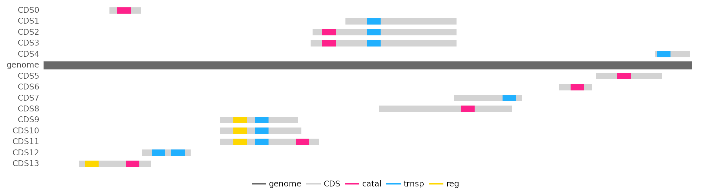

# Tutorials

## Simple Experiment

_MagicSoup_ is trying to only provide a simulation engine.
Everything else should be up to the user so that any experimental setup can be created.
However, this also means a lot of code has to be written by yourself.
As a simple example let's try to teach cells to convert CO2 into acetyl-CoA.
Cell survival will be based on intracellular acetyl-CoA concentrations and CO2 will be supplied in abundance.

### Chemistry

The most important thing of our simulated world is the [Chemistry][magicsoup.containers.Chemistry] object.
It defines which [Molecules][magicsoup.containers.Molecule] exist and how they move around,
which reactions are possible and how much energy they release.

Here, we will use the [Wood-Ljungdahl pathway](https://en.wikipedia.org/wiki/Wood%E2%80%93Ljungdahl_pathway) as inspiration.
There are a few molecule species and reactions that eventually acetylate coenzyme A.
Below, we create a file _chemistry.py_ in which we define all these molecules and reactions.
For the sake of brevity some steps were skipped.

```python
# chemistry.py
from magicsoup.containers import Molecule, Chemistry

NADPH = Molecule("NADPH", 200.0 * 1e3)
NADP = Molecule("NADP", 100.0 * 1e3)
ATP = Molecule("ATP", 100.0 * 1e3)
ADP = Molecule("ADP", 70.0 * 1e3)

methylFH4 = Molecule("methyl-FH4", 360.0 * 1e3)
methylenFH4 = Molecule("methylen-FH4", 300.0 * 1e3)
formylFH4 = Molecule("formyl-FH4", 240.0 * 1e3)
FH4 = Molecule("FH4", 200.0 * 1e3)
formiat = Molecule("formiat", 20.0 * 1e3)
co2 = Molecule("CO2", 10.0 * 1e3, diffusivity=1.0, permeability=1.0)

NiACS = Molecule("Ni-ACS", 200.0 * 1e3)
methylNiACS = Molecule("methyl-Ni-ACS", 300.0 * 1e3)
HSCoA = Molecule("HS-CoA", 200.0 * 1e3)
acetylCoA = Molecule("acetyl-CoA", 260.0 * 1e3)

MOLECULES = [
    NADPH,
    NADP,
    ATP,
    ADP,
    methylFH4,
    methylenFH4,
    formylFH4,
    FH4,
    formiat,
    co2,
    NiACS,
    methylNiACS,
    HSCoA,
    acetylCoA,
]

REACTIONS = [
    ([NADPH], [NADP]),
    ([ATP], [ADP]),
    ([co2], [formiat]),
    ([formiat, FH4], [formylFH4]),
    ([formylFH4], [methylenFH4]),
    ([methylenFH4], [methylFH4]),
    ([methylFH4, NiACS], [FH4, methylNiACS]),
    ([methylNiACS, co2, HSCoA], [NiACS, acetylCoA]),
]
```

Each molecule species was created with a unique name and an energy.
Except for CO2 all defaults are kept.
For CO2 permeability and diffusivity is increased to account for the fact that
it diffuses rapidly and can permeate through cell membranes.

Reactions are defined as tuples of products and substrates.
_E.g._ we defined a reaction ATP $\rightleftharpoons$ ADP as `([ATP], [ADP])`.
Here, ATP is defined with 100 kJ/mol and ADP with 70 kJ/mol.
Thus, ATP $\rightleftharpoons$ ADP releases 30 kJ/mol.
A stoichiometric number greater 1 can be expressed by listing the molecule species multiple times.
All reactions are reversible, so it is not necessary to define the reverse reaction.
See [Chemistry][magicsoup.containers.Chemistry] and [Molecule][magicsoup.containers.Molecule]
docs for more information.

### Setup

Eventually, we want to create a [Chemistry][magicsoup.containers.Chemistry]
and a [World][magicsoup.world.World] object and then step through time by repetitively calling different functions.
This is what our _main.py_ will look like:

```python
# main.py
import magicsoup as ms
from .chemistry import REACTIONS, MOLECULES

def prepare_medium(...):
    ...

def add_cells(...):
    ...

def activity(...):
    ...

def kill_cells(...):
    ...

def replicate_cells(...):
    ...

def mutate_cells(...):
    ...

def main():
    chemistry = ms.Chemistry(reactions=REACTIONS, molecules=MOLECULES)
    world = ms.World(chemistry=chemistry)
    prepare_medium()
    add_cells()

    for _ in range(10_000):
        activity()
        kill_cells()
        replicate_cells()
        mutate_cells()

if __name__ == "__main__":
    main()
```

Here, we prepare the medium, add some cells, and let the simulation run for 10k steps.
In each step cells can catalyze reactions and molecules can diffuse.
Then cells are selectively killed and replicated.
Finally, all surviving cells can experience mutations which change their genomes and proteomes.

### Adding molecules

When [World][magicsoup.world.World] is instantiated by default it fills the map with molecules
of all molecule species to an average concentration of 10 mM.
Here, we add extra CO2 and energy carriers.
Our cells don't have any mechanism for restoring these molecules.
Sooner or later they will run out of energy and CO2.
I am using indices to refer to different molecule species (see [Molecules](#molecules)).

```python
def prepare_medium(world: ms.World, i_co2: int, i_atp: int, i_nadph: int):
    world.molecule_map[i_atp] = 100.0
    world.molecule_map[i_nadph] = 100.0
    world.molecule_map[i_co2] = 100.0
```

### Adding cells

So far, there are no cells yet.
Cells can be spawned with [spawn_cells()][magicsoup.world.World.spawn_cells]
by providing genomes.
They will be placed in random pixels on the map and take up half the molecules
that were on that pixel.
There is a helper function [random_genome()][magicsoup.util.random_genome] that can be used to generate genomes of a certain size.

```python
def add_cells(world: ms.World, size=500, n_cells=1000):
    genomes = [ms.random_genome(s=size) for _ in range(n_cells)]
    world.spawn_cells(genomes=genomes)
```

### Cell Activity

This function essentially increments the world by one time step (1s).
[enzymatic_activity()][magicsoup.world.World.enzymatic_activity] lets cells catalyze reactions and transport molecules,
[degrade_molecules()][magicsoup.world.World.degrade_molecules] degrades molecules everywhere,
[diffuse_molecules()][magicsoup.world.World.diffuse_molecules] lets molecules diffuse and permeate,
[increment_cell_lifetimes()][magicsoup.world.World.increment_cell_lifetimes] increments cell lifetimes by 1.

```python
def activity(world: ms.World):
    world.enzymatic_activity()
    world.degrade_molecules()
    world.diffuse_molecules()
    world.increment_cell_lifetimes()
```

### Replicating and killing cells

These are the main levers for exerting evolutionary pressure.
Generally, we want to slowly increase or decrease the likelihood of cells dying or replicating over a certain variable (more on this in [Selection](#selection)).
Here, these variables will be intracellular molecule concentrations.

For killing cells we can look at intracellular ATP concentrations.
If they are low, chances of being killed are increased.
I also want to kill cells if their genomes get too big (see [Genome size](#genome-size)).
Cells are killed with [kill_cells()][magicsoup.world.World.kill_cells] by providing their indexes.
I am using a simple sigmoidal $f(x) = x^n/(x^n + c^n)$ to map likelihoods.

```python
def sample(p: torch.Tensor) -> list[int]:
    idxs = torch.argwhere(torch.bernoulli(p))
    return idxs.flatten().tolist()

def kill_cells(world: ms.World, i_atp: int):
    x = world.cell_molecules[:, i_atp]
    idxs = sample(1.0**7 / (1.0**7 + x**7))

    sizes = torch.tensor([len(d) for d in world.cell_genomes])
    idxs1 = sample(sizes**7 / (sizes**7 + 3_000.0**7))

    world.kill_cells(cell_idxs=list(set(idxs + idxs1)))
```

Cell replication will be based on acetyl-CoA.
Here, we could make the cell invest some energy in form of acetyl-CoA by converting it back to HS-CoA (taking away the acetyl group).
That forces the cell to continuously produce acetyl-CoA.
Cells can be divided with [divide_cells()][magicsoup.world.World.divide_cells] by providing their indexes.
The indexes of successfully replicated cells are returned.

```python
def replicate_cells(world: ms.World, i_aca: int, i_hca: int, cost=2.0):
    x = world.cell_molecules[:, i_aca]
    sampled_idxs = _sample(x**5 / (x**5 + 15.0**5))

    can_replicate = world.cell_molecules[:, i_aca] > cost
    allowed_idxs = torch.argwhere(can_replicate).flatten().tolist()
    
    idxs = list(set(sampled_idxs) & set(allowed_idxs))
    replicated = world.divide_cells(cell_idxs=idxs)
    
    if len(replicated) > 0:
        descendants = [dd for d in replicated for dd in d]
        world.cell_molecules[descendants, i_aca] -= cost / 2
        world.cell_molecules[descendants, i_hca] += cost / 2
```

Here, I decided that the cost of dividing is 2 mol acetyl-CoA.
Thus, I am also checking that only cells with at least 2 mol acetyl-CoA are allowed to divide.
After division their descendants have half of the ancestor's molecules.
To pay the price of dividing each descendant now has to hydrolyse 1 mol acetyl-CoA.
Note, I am not doing this before the replication because a cell might not successfully replicate.
If a cell has no space to replicate, it will not do so.

### Mutating cells

To continously create variation among cells they are all mutated at every step.
On [World][magicsoup.world.World] there are some functions to efficiently create mutations
and update the cells whose genomes have changed.
Below, I am using [mutate_cells()][magicsoup.world.World.mutate_cells],
which creates point mutations, with a rate of 1e-4 mutations per base pair.
I also decided to let recombinate with other cells if they have already lived for more than 10 steps.
[recombinate_cells()][magicsoup.world.World.recombinate_cells] works by creating random strand breaks.
Here, it creates 1e-6 strand brakes per base pair.

```python
def mutate_cells(world: ms.World, old=10):
    world.mutate_cells(p=1e-4)
    is_old = torch.argwhere(world.cell_lifetimes > old)
    world.recombinate_cells(cell_idxs=is_old.flatten().tolist(), p=1e-6)
```

[mutate_cells()][magicsoup.world.World.mutate_cells] and
[recombinate_cells()][magicsoup.world.World.recombinate_cells] are convenience functions.
You can also create mutations by yourself by just editing the strings in `world.cell_genomes`
and then calling [update_cells()][magicsoup.world.World.update_cells] for the cells that have changed.
More on that in [Genomes](#genomes).

### Putting it all together

Finally, we can combine everything in _main.py_.
In the functions above I always used indexes to reference certain molecule species on
`world.molecule_map` and `world.cell_molecules`.
Those indexes are derived from [Chemistry][magicsoup.containers.Chemistry].
Molecule species are always ordered in the same way as on `chemistry.molecules`.
For convenience there are 2 dictionaries `chemistry.molname_2_idx` and `chemistry.mol_2_idx`
for getting molecule indexes for either molecule names or molecule objects.

```python
# main.py
import torch
import magicsoup as ms
from .chemistry import REACTIONS, MOLECULES

def prepare_medium(world: ms.World, i_co2: int, i_atp: int, i_nadph: int):
    world.molecule_map[i_atp] = 100.0
    world.molecule_map[i_nadph] = 100.0
    world.molecule_map[i_co2] = 100.0

def add_cells(world: ms.World, size=500, n_cells=1000):
    genomes = [ms.random_genome(s=size) for _ in range(n_cells)]
    world.spawn_cells(genomes=genomes)

def activity(world: ms.World):
    world.enzymatic_activity()
    world.degrade_molecules()
    world.diffuse_molecules()
    world.increment_cell_lifetimes()

def sample(p: torch.Tensor) -> list[int]:
    idxs = torch.argwhere(torch.bernoulli(p))
    return idxs.flatten().tolist()

def kill_cells(world: ms.World, i_atp: int):
    x = world.cell_molecules[:, i_atp]
    idxs = sample(1.0**7 / (1.0**7 + x**7))

    sizes = torch.tensor([len(d) for d in world.cell_genomes])
    idxs1 = sample(sizes**7 / (sizes**7 + 3_000.0**7))

    world.kill_cells(cell_idxs=list(set(idxs + idxs1)))

def replicate_cells(world: ms.World, i_aca: int, i_hca: int, cost=2.0):
    x = world.cell_molecules[:, i_aca]
    sampled_idxs = _sample(x**5 / (x**5 + 15.0**5))

    can_replicate = world.cell_molecules[:, i_aca] > cost
    allowed_idxs = torch.argwhere(can_replicate).flatten().tolist()
    
    idxs = list(set(sampled_idxs) & set(allowed_idxs))
    replicated = world.divide_cells(cell_idxs=idxs)
    
    if len(replicated) > 0:
        descendants = [dd for d in replicated for dd in d]
        world.cell_molecules[descendants, i_aca] -= cost / 2
        world.cell_molecules[descendants, i_hca] += cost / 2

def mutate_cells(world: ms.World, old=10):
    world.mutate_cells(p=1e-4)
    is_old = torch.argwhere(world.cell_lifetimes > old)
    world.recombinate_cells(cell_idxs=is_old.flatten().tolist(), p=1e-6)

def main():
    chemistry = ms.Chemistry(reactions=REACTIONS, molecules=MOLECULES)
    world = ms.World(chemistry=chemistry)

    i_co2 = chemistry.molname_2_idx["CO2"]
    i_atp = chemistry.molname_2_idx["ATP"]
    i_adp = chemistry.molname_2_idx["ADP"]
    i_nadph = chemistry.molname_2_idx["NADPH"]
    i_nadp = chemistry.molname_2_idx["NADP"]
    i_aca = chemistry.molname_2_idx["acetyl-CoA"]
    i_hca = chemistry.molname_2_idx["HS-CoA"]

    prepare_medium(
        world=world,
        i_co2=i_co2,
        i_atp=i_atp,
        i_nadph=i_nadph,
    )
    add_cells(world=world)

    for _ in range(10_000):
        activity(world=world)
        kill_cells(world=world, atp=i_atp)
        replicate_cells(world=world, aca=i_aca, hca=i_hca)
        mutate_cells(world=world)

if __name__ == "__main__":
    main()
```

## Molecules

As you can see from the [experiment above](#simple-experiment) the [Chemistry][magicsoup.containers.Chemistry]
object is defined with molecules and reactions, both of which consist of [Molecule][magicsoup.containers.Molecule] objects.
Each [Molecule][magicsoup.containers.Molecule] object has attributes which describes the molecule species.

### Accessing molecules

During the simulation molecule concentrations are maintained on tensors on the [World][magicsoup.world.World] object.
`world.molecule_map` is a 3D tensor that defines molecule concentrations in the world map.
Dimension 0 describes the molecule species, dimension 1 the x-, dimension 2 the y-position.
`world.cell_molecules` is a 2D tensor that defines all intracellular molecule concentrations.
Dimension 0 describes the cell index, dimension 1 the molecule species.
Any tensor dimension or list describing molecule species is ordered according to the [Chemistry][magicsoup.containers.Chemistry]
object on `world.chemistry`.
So, if `world.chemistry.molecules[0]` is CO2,
`world.molecule_map[0]` describes the world map's CO2 concentrations,
and `world.cell_molecules[:, 0]` describes all intracellular CO2 concentrations.
For convencience [Chemistry][magicsoup.containers.Chemistry] has 2 mappings `chemistry.mol_2_idx` and `chemistry.molname_2_idx`
to map [Molecule][magicsoup.containers.Molecule] objects and molecule names to their indexes.

```python
i = world.chemistry.molname_2_idx["acetyl-CoA"]
world.chemistry.molecules[i].energy  # acetyl-CoA energy
world.molecule_map[i, 5, 6]  # acetyl-CoA concentration in world map at (5,6)
world.cell_molecules[10, i]  # acetyl-CoA concentration in cell 10
```

### Manipulating concentrations

You can manipulate these tensors to simulate certain conditions.
In the [experiment above](#simple-experiment) this is done to prepare fresh medium.
If cells should grow in batch culture, you would prepare fresh medium after passaging as described in [Passaging cells](#passaging-cells).
By regularly adding and removing certain molecules you can simulate a [Chemostat](https://en.wikipedia.org/wiki/Chemostat).


_1D gradient is created by manipulating and diffusing molecules each step. Molecules are added in the middle and removed at the edges._

Gradients can be created by adding and removing molecules in different places on the world map.
_E.g._ in the above figure the 1D gradient is created by calling the following function
and [diffuse_molecules()][magicsoup.world.World.diffuse_molecules] every step.

```python
def gradient1d(world: ms.World, mol_i: int):
    s = int(world.map_size / 2)
    world.molecule_map[mol_i, [s-1, s]] = 100.0
    world.molecule_map[mol_i, [0, -1]] = 1.0
```

Care must be taken to never create negative concentrations.
They would create NaNs and raise errors when calling [enzymatic_activity()][magicsoup.world.World.enzymatic_activity].
Also see [GPU and Tensors](#gpu-and-tensors) for performance implications.

## Genomes

In the [experiment above](#simple-experiment) 1000 cells were initially added
with random genomes of size 500 each.

```python
def add_cells(world: ms.World):
    genomes = [ms.random_genome(s=500) for _ in range(1000)]
    world.spawn_cells(genomes=genomes)
```

These genomes are maintained as a python list of strings on `world.cell_genomes`.
You can change them as you like (_e.g._ `world.cell_genomes[0] += "ACTG"`).
But whenever you change a genome, you must also update the cell's parameters
with [update_cells()][magicsoup.world.World.update_cells].
This figuratively transcribes and translates the genome and updates the cell's proteome.
[mutate_cells()][magicsoup.world.World.mutate_cells]
and [recombinate_cells()][magicsoup.world.World.recombinate_cells]
are convenience functions that first change `world.cell_genomes`
and then call [update_cells()][magicsoup.world.World.update_cells] for the cells
whose genomes have changed.

### Generating genomes

Instead of generating random genomes you might want to start with genomes
that contain specific genes.
Or maybe you want to introduce new genes at a certain step in the simulation.
This is what the [magicsoup.factories](./reference.md#magicsoupfactories) module is for.
With [CatalyticDomainFact][magicsoup.factories.CatalyticDomainFact],
[TransporterDomainFact][magicsoup.factories.TransporterDomainFact],
[RegulatoryDomainFact][magicsoup.factories.RegulatoryDomainFact],
desired domains can be defined.
These domain definitions can then be stringed together in a list to a protein definition,
and these again in a list to a proteome definition.
This is used with [GenomeFact][magicsoup.factories.GenomeFact] to generate genomes
that encode these proteomes.

```python
from .chemistry import co2, formiat, atp

p0 = [
    CatalyticDomainFact(reaction=([co2], [formiat]), vmax=10.0),
    RegulatoryDomainFact(effector=atp, is_transmembrane=False),
]
p1 = [
  TransporterDomainFact(molecule=atp, vmax=10.0)
]
ggen = GenomeFact(world=world, proteome=[p0, p1])
genomes = [ggen.generate() for _ in range(500)]
```

Here, I am generating 500 genomes that each translate into a proteome with 2 proteins.
One protein will be an ATP transporter,
the other will be an ATP-regulated catalytic domain with a cytosolic receptor that catalyzes $\text{CO2} \rightleftharpoons \text{formiat}$.
With each call to [generate()][magicsoup.factories.GenomeFact.generate]
a new sequence is generated that can encode the defined proteome.
Some domain specifications were provided, _e.g._ both domains have $v_{max} = 10$.
All undefined specifications are sampled, _e.g._ they all have random $K_m$.
Which parameters can be defined is described the the domain factories
[CatalyticDomainFact][magicsoup.factories.CatalyticDomainFact],
[TransporterDomainFact][magicsoup.factories.TransporterDomainFact],
[RegulatoryDomainFact][magicsoup.factories.RegulatoryDomainFact].
This can also be used to give existing cells new genes:

```python
p0 = [CatalyticDomainFact(reaction=world.chemistry.reactions[0])]
ggen = GenomeFact(world=world, proteome=[p0])
for i in range(world.n_cells):
    world.cell_genomes[i] += ggen.generate()
```

### Interpreting genomes

Conversely, there are also helper classes for interpreting existing genomes.
During the simulation world genomes are maintained on `world.cell_genomes`.
Without any information on how genes and parameters are encoded,
the raw genome strings cannot be interpreted.
Cell proteomes and molecule concentrations however are actually maintained as a combination of tensors.
[get_cell()][magicsoup.world.World.get_cell] is a helper function that
creates a [Cell][magicsoup.containers.Cell] object which represents
the cell with its genome, proteome, and molecule concentrations
in a convenient way.

```python
cell = world.get_cell(by_idx=0)  # get 0th cell
for i, protein in enumerate(cell.proteome):
    print(f"P{i}: {protein}")  # protein summary
```

_E.g._ the proteome is a list of [Proteins][magicsoup.containers.Protein] on `cell.proteome`.
Each protein contains information about its encoding CDS on the genome and its domains
which are a list made up of [CatalyticDomains][magicsoup.containers.CatalyticDomain],
[TransporterDomains][magicsoup.containers.TransporterDomain], and [RegulatoryDomains][magicsoup.containers.RegulatoryDomain].
See docs of [Cell][magicsoup.containers.Cell], [Proteins][magicsoup.containers.Protein] and domain object docs
to see which attributes are available.



_[Cell][magicsoup.containers.Cell] information is used to visualize transcriptome with domains color labeled by domain type.
5'-3' shown above the genome, reverse-complement below._

### Genome size

In the [experiment above](#simple-experiment) 1000 cells were initially added
with random genomes of size 500 each.
Mutations were intoduced and cells were killed and divided based on intracellular molecule concentrations.
During the simulation cells can and will grow larger genomes.
This means they can encode more proteins.


_Distributions for proteins per genome, domains per protein, and coding base pairs per base pair for different genome sizes._

Some cells happen to duplicate their entire genome or parts of their genome every now and then.
The longer the simulation goes on, the larger the maximum genome size grows.
Without any penalty to genome size, maximum genome size will increase over time (steps).
This can become a technical problem.
While most cells might still have a small proteome, some cells already have huge proteomes.
The tensors that maintain all cell proteomes have to grow according to the cell with most proteins.
This means memory consumption increases and performance decreases unnecessarily.

It makes sense to add a selection function based on genome size (see [Selection](#selection));
Not necessarily to enforce extremely small genomes, but to keep the maximum number of proteins at bay.

```python
def kill_cells(world: ms.World, i_atp: int):
    x = world.cell_molecules[:, i_atp]
    idxs = sample(1.0**7 / (1.0**7 + x**7))

    sizes = torch.tensor([len(d) for d in world.cell_genomes])
    idxs1 = sample(sizes**7 / (sizes**7 + 3_000.0**7))

    world.kill_cells(cell_idxs=list(set(idxs + idxs1)))
```

Here, I assumed that for my experiment a genome size of 1000 (with around 16 proteins) should be large enough.
With $f_{k,g} (s) = s^7 / (s^7 + 3000^7)$ cells should start dying quite rapidly once their genome size
exceeds 3000 base pairs.

## Selection

As long as cells can replicate, they can evolve by natural selection.
Better adapted cells will be able to replicate faster or die slower.
Aside from genome size (see [Genome size](#genome-size)) we used intracellular
ATP and acetyl-CoA concentrations to derive a probability for killing or replicating cells.

```python
def sample(p: torch.Tensor) -> list[int]:
    idxs = torch.argwhere(torch.bernoulli(p))
    return idxs.flatten().tolist()

def kill_cells(world: ms.World, i_atp: int):
    x = world.cell_molecules[:, i_atp]
    idxs = sample(1.0**7 / (1.0**7 + x**7))

    sizes = torch.tensor([len(d) for d in world.cell_genomes])
    idxs1 = sample(sizes**7 / (sizes**7 + 3_000.0**7))

    world.kill_cells(cell_idxs=list(set(idxs + idxs1)))

def replicate_cells(world: ms.World, i_aca: int, i_hca: int, cost=2.0):
    x = world.cell_molecules[:, i_aca]
    sampled_idxs = _sample(x**5 / (x**5 + 15.0**5))

    can_replicate = world.cell_molecules[:, i_aca] > cost
    allowed_idxs = torch.argwhere(can_replicate).flatten().tolist()
    
    idxs = list(set(sampled_idxs) & set(allowed_idxs))
    replicated = world.divide_cells(cell_idxs=idxs)
    
    if len(replicated) > 0:
        descendants = [dd for d in replicated for dd in d]
        world.cell_molecules[descendants, i_aca] -= cost / 2
        world.cell_molecules[descendants, i_hca] += cost / 2
```

Here, I used $f_k(x) = 1^7 / (1^7 + x^7)$ and $f_r(x) = x^5 / (x^5 + 15^5)$.
How to come up with useful functions and parameters?

### Estimating useful rates

It helps to guess some useful parameters to start with.
Say we use functions of the form $f(x) = x^n/(x^n + c^n)$ to map molecule concentrations to likelihoods.
We could try to set $c$ and $n$ in a way that that we have a good dynamic range for 0 to 5mM of $x$. 
Below I modelled the chance of a cell being killed or replicated for particular sets of $n$ and $c$
in cells with constant X concentrations.


_Probability of cells with constant X concentrations dying or dividing at least once when the chance to die depends on molecule concentration X with $p(X) =(X^7 + 1)^{-1}$ and the chance to replicate depends on it with $p(X) = X^5 / (X^5 + 15^5)$._

These events are not independent.
If a cell replicates, there are more cells that can replicate.
If it dies, it cannot replicate anymore.
Eventually, you still have to try out a bit by just running simulations.
While trying to come up with a good set of parameters you might see one of these patterns:

- **Cells die before forming a colony** 
  If they immediately die, the kill rate is probably too high.
  If it takes them many steps to die (with some cells lingering around for a while),
  it is probably too hard to replicate.
  In that case increase the replication rate.  
- **Cells quickly overgrow the map**
  The kill rate is probably too low.
  Only cells at the edge of the growing colony had a chance to adapt.
  Once the map is fully overgrown adaption ceases.
  There might be a well adapted cell somewhere but it cannot replicate.
- **Cells create wavefront, then die** If cells can replicate quickly,
  but also die quickly, they generate a wavefront of dividing cells which walks
  over the map in a few waves and then perishes.
  They often don't have enough time to adapt before going extinct.


_Example cell growth in 4 simulations over 1000 steps with different kill and replication rates. (Left) with moderately high kill rate and low replicaiton rate.(Middle-left) with high replication rate and low kill rate. (Middle-right) with high replication and kill rate. (Right) with moderate kill and replication rate. Cell map is black, cells are white, every 5th step was captured._

Ideally, cells struggle a bit to survive but not so much as to go extinct.
They should have some time to adapt and space to grow.
To keep cells in exponential growth phase indefinitely you can passage them.

### Passaging cells

In this simulation passaging cells would equate to selecting a few cells, killing the others,
creating fresh medium, then spreading the surviving cells.
This way the cells have new molecules and open space to grow.

```python
def split_cells(world: ms.World, split_ratio=0.3):
    keep_n = int(world.n_cells * split_ratio)
    kill_n = max(world.n_cells - keep_n, 0)
    idxs = random.sample(list(range(world.n_cells)), k=kill_n)
    world.kill_cells(cell_idxs=idxs)
    prepare_medium(world=world)
    world.reposition_cells(cell_idxs=list(range(world.n_cells)))
```

Passaging itself selects for fast growing cells.
Let's take the example from above with kill and replication functions $p_k(X) =(X^7 + 1)^{-1}$ and $p_r(X) = X^5 / (X^5 + 15^5)$.
The plot below shows simulated cell growth, where cells were passaged with different ratios whenever the total number of cells exeeded 7k.
Gray areas represent the total number of cells, stacked bar charts show the cell type composition before the passage.
We have cell types with X concentrations of 3, 4, 5, and 6.
As you can see all cell types except the fastest growing cell type (with $X=6$) quickly disappear.


_Simulated growth of cells with different molecule concentrations X when the chance to die depends on molecule concentration X with $p(X) =(X^7 + 1)^{-1}$ and the chance to replicate depends on it with $p(X) = X^5 / (X^5 + 15^5)$. Cells are split at different split ratios whenever they exceed a total count of 7000. Gray area represents total cell count, bars represent cell type composition before the split._


## Managing Simulation Runs

These are some examples for monitoring, checkpointing, and parametrizing simulations.
Let's assume a setup like described in the [experiment above](#simple-experiment).
So, the _main.py_ looks something like this:

```python
# main.py
import torch
import magicsoup as ms
from .chemistry import REACTIONS, MOLECULES

...

def main():
    chemistry = ms.Chemistry(reactions=REACTIONS, molecules=MOLECULES)
    world = ms.World(chemistry=chemistry)
    ...

    for _ in range(10_000):
        ...

if __name__ == "__main__":
    main()
```

### Monitoring

One nice tool for monitoring an ongoing simulation is [TensorBoard](https://www.tensorflow.org/tensorboard).
It's an app that watches a directory and displays logged data as line charts, histograms, images and more.
It can be installed from [PyPI](https://pypi.org/project/tensorboard/).
_PyTorch_ already includes a `SummaryWriter` that can be used for writing these logging files.

```python
# main.py
import datetime as dt
from pathlib import Path
import torch
from torch.utils.tensorboard import SummaryWriter
import magicsoup as ms
from .chemistry import REACTIONS, MOLECULES

THIS_DIR = Path(__file__).parent
...

def main():
    now = dt.datetime.now().strftime("%Y-%m-%d_%H-%M")
    writer = SummaryWriter(log_dir=THIS_DIR / "runs" / now)

    chemistry = ms.Chemistry(reactions=REACTIONS, molecules=MOLECULES)
    world = ms.World(chemistry=chemistry)
    ...

    for _ in range(10_000):
        ...

if __name__ == "__main__":
    main()
```

When it is instantiated it creates `log_dir` if it doesn't already exist.
This is where all the logging files will go.
Add `runs/` to `.gitignore` to avoid committing this directory.
In the example above, I am also adding the current date and time as a a subdirectory,
so that you can start a run multiple times without overriding the previous ones.

How to use the `SummaryWriter` is explained in [the docs](https://pytorch.org/docs/stable/tensorboard.html).
It supports a few data types.
We will start with recording some scalars about cell growth.
Additionally, we can visualize the cell map by taking a picture of it.
These pictures are a bit heavy, so we will only capture one every 10 steps. 

```python
# main.py
import datetime as dt
from pathlib import Path
import torch
from torch.utils.tensorboard import SummaryWriter
import magicsoup as ms
from .chemistry import REACTIONS, MOLECULES

THIS_DIR = Path(__file__).parent
...

def write_scalars(world: ms.World, writer: SummaryWriter, step: int):
    writer.add_scalar("Cells/Total[n]", world.n_cells, step)
    writer.add_scalar("Cells/Survival[avg]", world.cell_lifetimes.mean(), step)
    writer.add_scalar("Cells/Divisions[avg]", world.cell_divisions.mean(), step)

def write_images(world: ms.World, writer: SummaryWriter, step: int):
    writer.add_image("Maps/Cells", world.cell_map, step, dataformats="WH")

def main():
    now = dt.datetime.now().strftime("%Y-%m-%d_%H-%M")
    writer = SummaryWriter(log_dir=THIS_DIR / "runs" / now)

    chemistry = ms.Chemistry(reactions=REACTIONS, molecules=MOLECULES)
    world = ms.World(chemistry=chemistry)
    ...

    for step in range(10_000):
        ...
        write_scalars(world=world, writer=writer, step=step)
        if step % 10 == 0:
            write_images(world=world, writer=writer, step=step)

if __name__ == "__main__":
    main()
```

There is a pattern to labelling the variables on how they will be displayed in the app.
_E.g._ there will be a _Cells_ and a _Maps_ section.
The image dataformat is `WH` because dimension 0 of `world.cell_map` represents the x axis,
and dimension 1 the y axis.
You can start the app by pointing it at the runs directory `tensorboard --logdir=./runs`.


_Watching 2 scalars and 1 image while a simulation is running_

### Parameters

You might want to parametrize _main.py_ so that you can start it with different conditions.
Let's say we want to parametrize the number of steps: sometimes we just want to run a few steps to see if it works,
sometimes we want to start a long run with thousands of steps.
There are many tools for that.
I am going to stick to the standard library and use [argparse](https://docs.python.org/3/library/argparse.html).

```python
# main.py
import datetime as dt
from argparse import ArgumentParser
import torch
import magicsoup as ms
from .chemistry import REACTIONS, MOLECULES

...

def main(kwargs: dict):
    chemistry = ms.Chemistry(reactions=REACTIONS, molecules=MOLECULES)
    world = ms.World(chemistry=chemistry)
    ...

    for _ in range(kwargs["n_steps"]):
        ...

if __name__ == "__main__":
    parser = ArgumentParser()
    parser.add_argument("--n-steps", default=10_000, type=int)
    parsed_args = parser.parse_args()
    main(vars(parsed_args))
```

### Checkpoints

[World][magicsoup.world.World] has some functions for saving (and loading) itself.
[save()][magicsoup.world.World.save] is used to save the whole world object as pickle file.
It can be restored using [from_file()][magicsoup.world.World.from_file].
However, during the simulation not everything on the world object changes.
A smaller and quicker way to save is [save_state()][magicsoup.world.World.save_state].
It only saves the parts which change when running the simulation (will write a few `.pt` and `.fasta` files).
A state can be restored with [load_state()][magicsoup.world.World.load_state].
So, in the beginning one [save()][magicsoup.world.World.save] is needed to save the whole object.
Then, [save_state()][magicsoup.world.World.save_state] can be used to save a certain time point.

```python
# main.py
import datetime as dt
from pathlib import Path
import torch
import magicsoup as ms
from .chemistry import REACTIONS, MOLECULES

THIS_DIR = Path(__file__).parent
...

def main():
    outdir = THIS_DIR / "runs" / dt.datetime.now().strftime("%Y-%m-%d_%H-%M")
    outdir.mkdir(exist_ok=True, parents=True)

    chemistry = ms.Chemistry(reactions=REACTIONS, molecules=MOLECULES)
    world = ms.World(chemistry=chemistry)
    world.save(rundir=outdir)
    ...

    for step in range(10_000):
        ...
        if step % 100 == 0:
            world.save_state(statedir=outdir / f"step={step}")

if __name__ == "__main__":
    main()
```

As in the examples above I am creating a _runs_ directory with the current date and time.
I am also not saving every step to reduce the time spend saving and the size of _runs/_.


## GPU and Tensors

[PyTorch](https://pytorch.org/) is used a lot in this simulation.
When initializing [World][magicsoup.world.World] parameter `device` can be used to move most calculations to a GPU.
_E.g._ with `device="cuda"` the default CUDA device is used (see [pytorch CUDA semantics](https://pytorch.org/docs/stable/notes/cuda.html)).
Using a GPU usually speeds up the simulation by more than 100 times.

To achieve this performance cells and molecules are not represented as python objects.
Instead [World][magicsoup.world.World] maintains python lists and [PyTorch Tensors](https://pytorch.org/docs/stable/tensors.html).
Some of those tensors where used in the [example above](#simple-experiment): `world.molecule_map` and `world.cell_molecules`.
All lists and tensors that can be used to interact with the simulation are listed in
the [World][magicsoup.world.World] class documentation.
To keep performance high these data should be moved back and forth between GPU and CPU as little as possible.

```python
# float tensors on GPU get modified (fast)
world.molecule_map[0] = 10.0
world.cell_molecules[0] += 1.0
world.cell_molecules[world.cell_divisions > 10, 3] -= 1.0

mask = world.cell_lifetimes > 10  # bool tensor on GPU (fast)
idx_tensor = torch.argwhere(mask)  # long tensor on GPU (fast)
idx_lst = idx_tensor.flatten().tolist()  # tolist() sends integers to CPU (slow)

values = world.cell_divisions.float()  # convert integer to float tensor on GPU (fast)
mean = values.mean()  # calculate mean as 1-item float tensor on GPU (fast)
value = mean.item()  # item() sends value to CPU (slow)
```

There is a [PyTorch tutorial](https://pytorch.org/tutorials/beginner/introyt/tensors_deeper_tutorial.html)
for working with tensors but in general you should try to use [tensor methods](https://pytorch.org/docs/stable/torch.html).
If you are familiar with [NumPy](https://numpy.org/) this should come easy.
Equivalents for most ndarray methods also exist on torch tensors.
