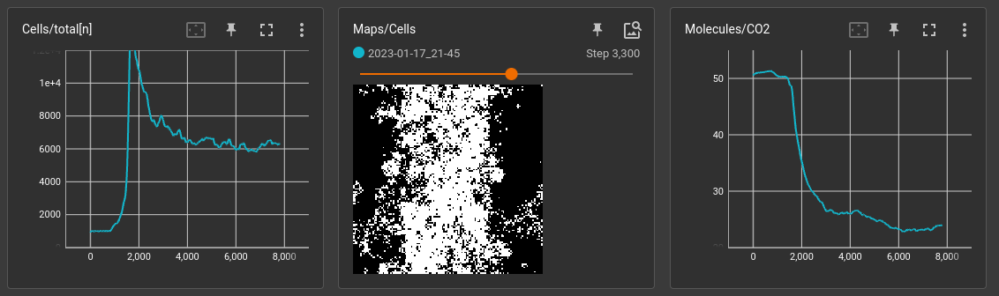
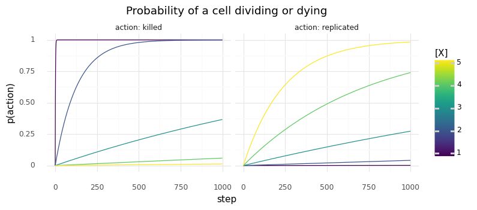
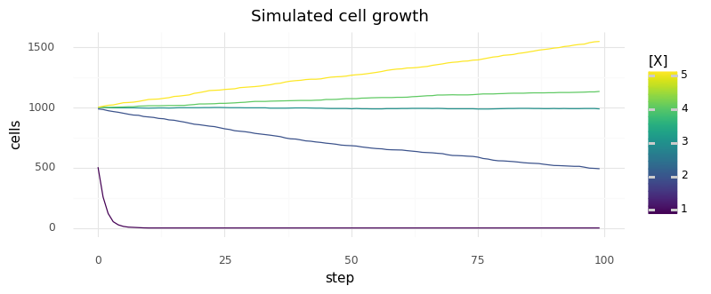
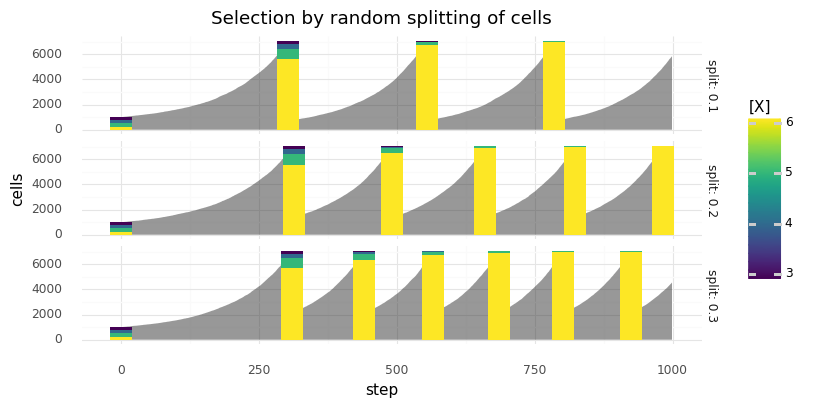
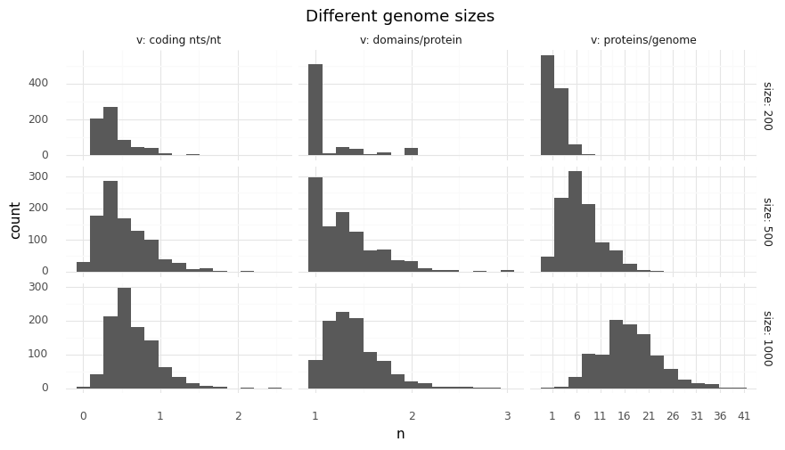
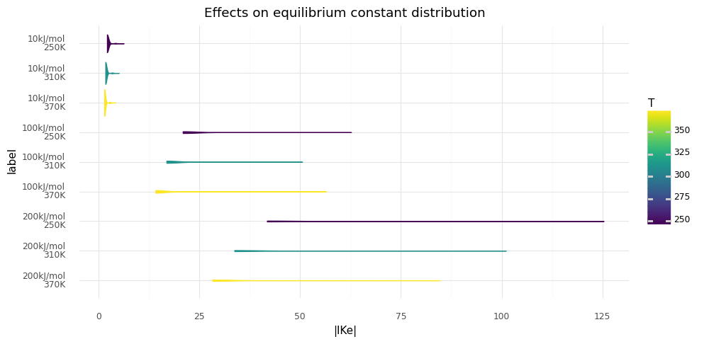
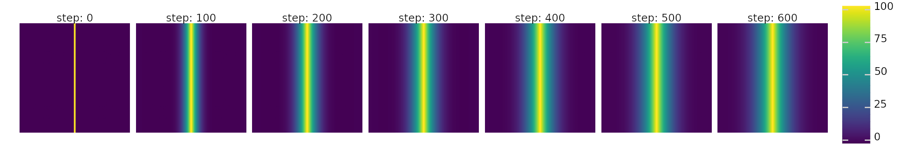

# Tutorials

## Simple Experiment

As an example let's try to teach cells to convert CO2 into acetyl-CoA.
Cell survival will be based on intracellular acetyl-CoA concentrations and CO2 will be supplied in abundance.

### Chemistry

The most important thing of our simulated world is the [Chemistry][magicsoup.containers.Chemistry] object.
It defines which molecule species exist and how they move around, which reactions are possible and how much energy they need.
With all the proteomes our cells will develop, they are always constrained by this chemistry.

Here, we will use the [Wood-Ljungdahl pathway](https://en.wikipedia.org/wiki/Wood%E2%80%93Ljungdahl_pathway) as inspiration.
There are a few molecule species and reactions that eventually acetylate coenzyme A.
Below, we create a file _chemistry.py_ in which we define all these molecules and reactions.
For the sake of brevity some steps in the carbonyl branch were aggregated.

```python
# chemistry.py
from magicsoup.containers import Molecule, Chemistry

NADPH = Molecule("NADPH", 200.0 * 1e3)
NADP = Molecule("NADP", 100.0 * 1e3)
ATP = Molecule("ATP", 100.0 * 1e3)
ADP = Molecule("ADP", 70.0 * 1e3)

methylFH4 = Molecule("methyl-FH4", 360.0 * 1e3)
methylenFH4 = Molecule("methylen-FH4", 300.0 * 1e3)
formylFH4 = Molecule("formyl-FH4", 240.0 * 1e3)
FH4 = Molecule("FH4", 200.0 * 1e3)
formiat = Molecule("formiat", 20.0 * 1e3)
co2 = Molecule("CO2", 10.0 * 1e3, diffusivity=1.0, permeability=1.0)

NiACS = Molecule("Ni-ACS", 200.0 * 1e3)
methylNiACS = Molecule("methyl-Ni-ACS", 300.0 * 1e3)
HSCoA = Molecule("HS-CoA", 200.0 * 1e3)
acetylCoA = Molecule("acetyl-CoA", 260.0 * 1e3)

MOLECULES = [
    NADPH,
    NADP,
    ATP,
    ADP,
    methylFH4,
    methylenFH4,
    formylFH4,
    FH4,
    formiat,
    co2,
    NiACS,
    methylNiACS,
    HSCoA,
    acetylCoA,
]

REACTIONS = [
    ([NADPH], [NADP]),
    ([ATP], [ADP]),
    ([co2], [formiat]),
    ([formiat, FH4], [formylFH4]),
    ([formylFH4], [methylenFH4]),
    ([methylenFH4], [methylFH4]),
    ([methylFH4, NiACS], [FH4, methylNiACS]),
    ([methylNiACS, co2, HSCoA], [NiACS, acetylCoA]),
]
```

Each molecule species was created with a unique name and an energy.
This energy has effects on reaction energies (more on this in [Molecule energies](#molecule-energies)).
So, here _ATP_ is defined with _100 kJ/mol_. Its hydrolysis to _ADP_ releases _30 kJ/mol_.
Except for _CO2_ all defaults are kept.
For _CO2_ permeability and diffusivity is increased to account for the fact that
it diffuses rapidly and can permeate through cell membranes.

The reactions are tuples of lists of these molecule species.
The first tuple entry defined all substrates, the second all products.
A stoichiometric number >1 can be expressed by listing the molecule species multiple times.
All reactions are reversible, so it is not necessary to define the reverse reaction.
In which direction a reaction will progress depends on its reaction energy and quotient.

### Setup

Eventually, we want to create [Chemistry][magicsoup.containers.Chemistry]
and [World][magicsoup.world.World] and then step through time by repetitively calling different functions.
This is what our _main.py_ will look like:

```python
# main.py
import magicsoup as ms
from .chemistry import REACTIONS, MOLECULES

def prepare_medium(...):
    ...

def add_cells(...):
    ...

def activity(...):
    ...

def kill_cells(...):
    ...

def replicate_cells(...):
    ...

def mutate_cells(...):
    ...

def main():
    chemistry = ms.Chemistry(reactions=REACTIONS, molecules=MOLECULES)
    world = ms.World(chemistry=chemistry)
    prepare_medium()
    add_cells()

    for _ in range(10_000):
        activity()
        kill_cells()
        replicate_cells()
        mutate_cells()

if __name__ == "__main__":
    main()
```

Here, we prepare the medium, add some cells, and let the simulation run for 10k steps.
In each step cells can catalyze reactions and molecules can diffuse.
Then cells are selectively killed and replicated.
Finally, all surviving cells can undergo mutations.

### Adding molecules

When [World][magicsoup.world.World] is instantiated by default it fills the map with molecules
of all molecule species to an average concentration of 10 mM.
Here, we add extra CO2 and energy.
Out cells don't really have a mechanism for restoring these energy carriers.
Sooner or later they will run out of energy.

```python
def prepare_medium(world: ms.World, co2: int, atp: int, adp: int, nadph: int, nadp: int):
    world.cell_molecules[:, atp] = 100.0
    world.cell_molecules[:, adp] = 0.0
    world.cell_molecules[:, nadph] = 100.0
    world.cell_molecules[:, nadp] = 0.0
    world.molecule_map[co2] = 100.0
```

### Adding cells

So far, there are no cells yet.
Cells can be spawned with [spawn_cells()][magicsoup.world.World.spawn_cells]
by providing genomes.
They will be placed in random positions on the map and take up half the molecules
that were on that position.
There is a helper function `random_genome()` that can be used to generate genomes of a certain size.

```python
def add_cells(world: ms.World):
    genomes = [ms.random_genome(s=500) for _ in range(1000)]
    world.spawn_cells(genomes=genomes)  
```

### Cell Activity

This function essentially increments the world by one time step (1s).
`world.enzymatic_activity()` lets cels catalyze reactions and transport molecules,
`world.degrade_molecules()` degrades molecules everywhere,
`world.diffuse_molecules()` lets molecules diffuse and permeate,
`world.increment_cell_lifetimes()` increments cell lifetimes by 1.
I also added a mechanism that slowly hydrolyzes ATP in all living cells.
This makes inactive cells die over time (see below).
Care has to be taken not to accidentally create negative concentrations.

```python
def activity(world: ms.World, atp: int, adp: int):
    world.cell_molecules[:, atp] -= 0.01
    world.cell_molecules[:, adp] += 0.01
    world.cell_molecules[world.cell_molecules[:, atp] < 0.0, atp] = 0.0
    world.enzymatic_activity()
    world.degrade_molecules()
    world.diffuse_molecules()
    world.increment_cell_lifetimes()
```

### Replicating and killing cells

These are the main levers for exerting evolutionary pressure.
Generally, we want to slowly increase or decrease the likelihood of cells dying or replicating over a certain variable (more on this in [Selection](#selection)).
Here, these variables will be intracellular molecule concentrations.

For killing cells we can look at intracellular ATP concentrations.
If they are low, chances of being killed are increased.
Cells are killed with [kill_cells()][magicsoup.world.World.kill_cells] by providing their indexes.

```python
def sample(p: torch.Tensor) -> list[int]:
    idxs = torch.argwhere(torch.bernoulli(p))
    return idxs.flatten().tolist()

def kill_cells(world: ms.World, atp: int):
    x0 = world.cell_molecules[:, atp]
    idxs = sample(1.0**7 / (1.0**7 + x0**7))
    world.kill_cells(cell_idxs=idxs)
```

Cell replication should be based on acetyl-CoA.
Here, we could make the cell invest some energy in form of acetyl-CoA by converting it back to HS-CoA (taking away the acetyl group).
That way a cell has to continuously produce acetyl-CoA in order to replicate.
Cells can be replicated with [divide_cells()][magicsoup.world.World.divide_cells] by providing their indexes.
The indexes of successfully replicated cells are returned (if the cell has no space to replicate, it will not do so).

```python
def replicate_cells(world: ms.World, aca: int, hca: int):
    x = world.cell_molecules[:, aca]
    chosen = _sample(x**5 / (x**5 + 15.0**5))

    allowed = torch.argwhere(world.cell_molecules[:, aca] > 2.0).flatten().tolist()
    idxs = list(set(chosen) & set(allowed))

    replicated = world.divide_cells(cell_idxs=idxs)
    if len(replicated) > 0:
        parents, children = list(map(list, zip(*replicated)))
        world.cell_molecules[parents + children, aca] -= 1.0
        world.cell_molecules[parents + children, hca] += 1.0
```

As you can see I am using functions of the form $f(x) = x^n/(x^n + c^n)$
to map molecule concentrations to likelihoods.
It's a simple sigmoid.

### Mutating cells

To continously create variation among cells they are all mutated at every step.
There are some functions for mutating genomes already provided in the `ms.mutations` module.
Here, I am using [point_mutations()][magicsoup.mutations.point_mutations] to apply random
point mutations with a rate of 1e-6 per nucleotide. 40% of them are InDels.

This alone would only for vertical inheritance, which is very limiting.
[recombinations()][magicsoup.mutations.recombinations] creates random recombinations
between genome pairs.
Here, we subject all neighbouring cells lateral gene transfer.

```python
def mutate_cells(world: ms.World):
    mutated = ms.point_mutations(seqs=world.cell_genomes)
    world.update_cells(genome_idx_pairs=mutated)

    nghbrs = world.get_neighbors(cell_idxs=list(range(world.n_cells)))
    nghbr_genomes = [(world.cell_genomes[a], world.cell_genomes[b]) for a, b in nghbrs]
    
    mutated = []
    for sa, sb, idx in ms.recombinations(seq_pairs=nghbr_genomes):
        a, b = nghbrs[idx]
        mutated.append((sa, a))
        mutated.append((sb, b))
    world.update_cells(genome_idx_pairs=mutated)
```

[update_cells()][magicsoup.world.World.update_cells] is used to update the cells whose genome was altered.
This function derives each cell's new proteome and updates its parameters.

### Putting it all together

Finally, we can combine everything in _main.py_.
In the functions above I always used indexes to reference certain molecule species on
`world.molecule_map` and `world.cell_molecules`. Those indexes are derived from [Chemistry][magicsoup.containers.Chemistry].
Molecule species are always ordered in the same way as on `chemistry.molecules`.
Below, I am creating a name-to-index mapping for these molecule with `mol_2_idx = {d.name: i for i, d in enumerate(chemistry.molecules)}`
after [Chemistry][magicsoup.containers.Chemistry] is instantiated.

```python
# main.py
import torch
import magicsoup as ms
from .chemistry import REACTIONS, MOLECULES

def prepare_medium(world: ms.World, co2: int, atp: int, adp: int, nadph: int, nadp: int):
    world.cell_molecules[:, atp] = 100.0
    world.cell_molecules[:, adp] = 0.0
    world.cell_molecules[:, nadph] = 100.0
    world.cell_molecules[:, nadp] = 0.0
    world.molecule_map[co2] = 100.0

def add_cells(world: ms.World):
    genomes = [ms.random_genome(s=500) for _ in range(1000)]
    world.spawn_cells(genomes=genomes)

def activity(world: ms.World, atp: int, adp: int):
    world.cell_molecules[:, atp] -= 0.01
    world.cell_molecules[:, adp] += 0.01
    world.cell_molecules[world.cell_molecules[:, atp] < 0.0, atp] = 0.0
    world.enzymatic_activity()
    world.degrade_molecules()
    world.diffuse_molecules()
    world.increment_cell_lifetimes()

def sample(p: torch.Tensor) -> list[int]:
    idxs = torch.argwhere(torch.bernoulli(p))
    return idxs.flatten().tolist()

def kill_cells(world: ms.World, atp: int):
    x0 = world.cell_molecules[:, atp]
    idxs = sample(1.0**7 / (1.0**7 + x0**7))
    world.kill_cells(cell_idxs=idxs)

def replicate_cells(world: ms.World, aca: int, hca: int):
    x = world.cell_molecules[:, aca]
    chosen = _sample(x**5 / (x**5 + 15.0**5))

    allowed = torch.argwhere(world.cell_molecules[:, aca] > 2.0).flatten().tolist()
    idxs = list(set(chosen) & set(allowed))

    replicated = world.divide_cells(cell_idxs=idxs)
    if len(replicated) > 0:
        parents, children = list(map(list, zip(*replicated)))
        world.cell_molecules[parents + children, aca] -= 1.0
        world.cell_molecules[parents + children, hca] += 1.0

def mutate_cells(world: ms.World):
    mutated = ms.point_mutations(seqs=world.cell_genomes)
    world.update_cells(genome_idx_pairs=mutated)

    nghbrs = world.get_neighbors(cell_idxs=list(range(world.n_cells)))
    nghbr_genomes = [(world.cell_genomes[a], world.cell_genomes[b]) for a, b in nghbrs]
    
    mutated = []
    for sa, sb, idx in ms.recombinations(seq_pairs=nghbr_genomes):
        a, b = nghbrs[idx]
        mutated.append((sa, a))
        mutated.append((sb, b))
    world.update_cells(genome_idx_pairs=mutated)

def main():
    chemistry = ms.Chemistry(reactions=REACTIONS, molecules=MOLECULES)
    world = ms.World(chemistry=chemistry)

    i_co2 = chemistry.molname_2_idx["CO2"]
    i_atp = chemistry.molname_2_idx["ATP"]
    i_adp = chemistry.molname_2_idx["ADP"]
    i_nadph = chemistry.molname_2_idx["NADPH"]
    i_nadp = chemistry.molname_2_idx["NADP"]
    i_aca = chemistry.molname_2_idx["acetyl-CoA"]
    i_hca = chemistry.molname_2_idx["HS-CoA"]

    prepare_medium(
        world=world,
        co2=i_co2,
        atp=i_atp,
        adp=i_adp,
        nadph=i_nadph,
        nadp=i_nadp,
    )
    add_cells(world=world)

    for _ in range(10_000):
        activity(world=world, atp=i_atp, adp=i_adp)
        kill_cells(world=world, atp=i_atp)
        replicate_cells(world=world, aca=i_aca, hca=i_hca)
        mutate_cells(world=world)

if __name__ == "__main__":
    main()
```

## Boilerplate

These are some examples for monitoring, checkpointing, and parametrizing simulations.
Let's assume a setup like described in the [experiment above](#simple-experiment).
So, the _main.py_ looks something like this:

```python
# main.py
import torch
import magicsoup as ms
from .chemistry import REACTIONS, MOLECULES

...

def main():
    chemistry = ms.Chemistry(reactions=REACTIONS, molecules=MOLECULES)
    world = ms.World(chemistry=chemistry)
    ...

    for _ in range(10_000):
        ...

if __name__ == "__main__":
    main()
```

### Monitoring

One nice tool for monitoring an ongoing simulation run is [TensorBoard](https://www.tensorflow.org/tensorboard).
It's an app that watches a directory and displays logged data as line charts, histograms, images and more.
It can be installed from [pipy](https://pypi.org/project/tensorboard/).
_pytorch_ already includes a `SummaryWriter` that can be used for writing these logging files.

```python
# main.py
import datetime as dt
from pathlib import Path
import torch
from torch.utils.tensorboard import SummaryWriter
import magicsoup as ms
from .chemistry import REACTIONS, MOLECULES

THIS_DIR = Path(__file__).parent
...

def main():
    now = dt.datetime.now().strftime("%Y-%m-%d_%H-%M")
    writer = SummaryWriter(log_dir=THIS_DIR / "runs" / now)

    chemistry = ms.Chemistry(reactions=REACTIONS, molecules=MOLECULES)
    world = ms.World(chemistry=chemistry)
    ...

    for _ in range(10_000):
        ...

if __name__ == "__main__":
    main()
```

When it is instantiated it creates `log_dir` if it doesn't already exist.
This is where all the logging files will go.
Add `runs/` to `.gitignore` to avoid committing this directory.
In the example above, I am also adding the current date and time as a a subdirectory,
so that you can start a run multiple times without overriding the previous ones.

How to use the `SummaryWriter` is explained in [the docs](https://pytorch.org/docs/stable/tensorboard.html).
It supports a few data types.
We will start with recording some scalars about cell growth.
Additionally, we can visualize the cell map by taking a picture of it.
These pictures are a bit heavy, so we will only capture one every 10 steps. 

```python
# main.py
import datetime as dt
from pathlib import Path
import torch
from torch.utils.tensorboard import SummaryWriter
import magicsoup as ms
from .chemistry import REACTIONS, MOLECULES

THIS_DIR = Path(__file__).parent
...

def write_scalars(world: ms.World, writer: SummaryWriter, step: int):
    writer.add_scalar("Cells/total[n]", world.n_cells, step)
    writer.add_scalar("Cells/Survival[avg]", world.cell_lifetimes.mean(), step)
    writer.add_scalar("Cells/Divisions[avg]", world.cell_divisions.mean(), step)

def write_images(world: ms.World, writer: SummaryWriter, step: int):
    writer.add_image("Maps/Cells", world.cell_map, step, dataformats="WH")

def main():
    now = dt.datetime.now().strftime("%Y-%m-%d_%H-%M")
    writer = SummaryWriter(log_dir=THIS_DIR / "runs" / now)

    chemistry = ms.Chemistry(reactions=REACTIONS, molecules=MOLECULES)
    world = ms.World(chemistry=chemistry)
    ...

    for step in range(10_000):
        ...
        write_scalars(world=world, writer=writer, step=step)
        if step % 10 == 0:
            write_images(world=world, writer=writer, step=step)

if __name__ == "__main__":
    main()
```

There is a pattern to labelling the variables on how they will be displayed in the app.
_E.g._ there will be a _Cells_ and a _Maps_ section.
The image dataformat is `WH` because dimension 0 of `world.cell_map` represents the x axis,
and dimension 1 the y axis.
You can start the app by pointing it at the runs directory `tensorboard --logdir=./runs`.


_Watching 2 scalars and 1 image while a simulation is running_

### Parameters

You might want to parametrize _main.py_ so that you can start it with different conditions.
Let's say we want to parametrize the number of steps: sometimes we just want to run a few steps to see if it works,
sometimes we want to start a long run with thousands of steps.
There are many tools for that.
I am going to stick to the standard library and use [argparse](https://docs.python.org/3/library/argparse.html).

```python
# main.py
import json
import datetime as dt
from pathlib import Path
from argparse import ArgumentParser, Namespace
import torch
import magicsoup as ms
from .chemistry import REACTIONS, MOLECULES

THIS_DIR = Path(__file__).parent
...

def main(kwargs: dict):
    outdir = THIS_DIR / "runs" / dt.datetime.now().strftime("%Y-%m-%d_%H-%M")
    outdir.mkdir(exist_ok=True, parents=True)
    with open(outdir / "hparams.json", "w") as fh:
        json.dump(vars(args), fh)

    chemistry = ms.Chemistry(reactions=REACTIONS, molecules=MOLECULES)
    world = ms.World(chemistry=chemistry)
    ...

    for _ in range(kwargs["n_steps"]):
        ...

if __name__ == "__main__":
    parser = ArgumentParser()
    parser.add_argument("--n-steps", default=10_000, type=int)
    parsed_args = parser.parse_args()
    main(args=vars(parsed_args))
```

### Checkpoints

[World][magicsoup.world.World] has some functions for saving (and loading) itself.
[save()][magicsoup.world.World.save] is used to save the whole world object as pickle file.
It can be restored using [from_file()][magicsoup.world.World.from_file].
However, during the simulation not everything on the world object changes.
A smaller and quicker way to save is [save_state()][magicsoup.world.World.save_state].
It only saves the parts which change when running the simulation (will write a few `.pt` files).
A state can be restored with [load_state()][magicsoup.world.World.load_state].
So, in the beginning one [save()][magicsoup.world.World.save] is needed to save the whole object.
Then, [save_state()][magicsoup.world.World.save_state] can be used to save a certain time point.

```python
# main.py
import datetime as dt
from pathlib import Path
import torch
import magicsoup as ms
from .chemistry import REACTIONS, MOLECULES

THIS_DIR = Path(__file__).parent
...

def main():
    outdir = THIS_DIR / "runs" / dt.datetime.now().strftime("%Y-%m-%d_%H-%M")
    outdir.mkdir(exist_ok=True, parents=True)

    chemistry = ms.Chemistry(reactions=REACTIONS, molecules=MOLECULES)
    world = ms.World(chemistry=chemistry)
    world.save(rundir=outdir)
    ...

    for step in range(10_000):
        ...
        if step % 100 == 0:
            world.save_state(statedir=outdir / f"step={step}")

if __name__ == "__main__":
    main()
```

As in the examples above I am creating a _runs_ directory with the current date and time.
I am also not saving every step to reduce the time spend saving and the size of _runs/_.

## Selection

As long as cells can replicate, they can evolve by natural selection.
Better adapted cells will be able to replicate faster or die slower.
In the [experiment above](#simple-experiment) we used some functions to
derive a probability for killing or replicating cells based on intracellular ATP and acetyl-CoA concentrations.

```python
def sample(p: torch.Tensor) -> list[int]:
    idxs = torch.argwhere(torch.bernoulli(p))
    return idxs.flatten().tolist()

def kill_cells(world: ms.World, atp: int):
    x0 = world.cell_molecules[:, atp]
    idxs = sample(1.0**7 / (1.0**7 + x0**7))
    world.kill_cells(cell_idxs=idxs)

def replicate_cells(world: ms.World, aca: int, hca: int):
    x = world.cell_molecules[:, aca]
    chosen = _sample(x**5 / (x**5 + 15.0**5))

    allowed = torch.argwhere(world.cell_molecules[:, aca] > 2.0).flatten().tolist()
    idxs = list(set(chosen) & set(allowed))

    replicated = world.divide_cells(cell_idxs=idxs)
    if len(replicated) > 0:
        parents, children = list(map(list, zip(*replicated)))
        world.cell_molecules[parents + children, aca] -= 1.0
        world.cell_molecules[parents + children, hca] += 1.0
```

How to come up with useful numbers?
If you just randomly pick some numbers, one of 2 things is likely to happen:

- **All cells die** On average cells die before they have a chance to replicate.
  If they die very slowly, it might mean it is too hard to replicate.
  If they die very quickly, the kill-rate is too high.
- **Cells overgrow the map, then nothing happens** The kill-rate is too low.
  Only cells at the edge of the growing colony had a chance to adapt.
  Once the map is fully overgrown adaption ceases.
  There might be a better adapted cell somewhere but it cannot replicate anymore.

Eventually you have to fine-tune these 2 rates.
If the kill-rate is too low, it will not affect selection.
Ideally, cells struggle a bit to survive but not so much as to go extinct.
If the replication rate is too high, the map is quickly overgrown by even not-so-well adapted cells.
The map will be full before better adapted cells can evolve.
If both rates are high, a wavefront of replicating and dying cells can appear.
This wavefront marches over the whole map and converts some molecule species before it disappears with all its cells dying.

### Estimating useful rates

It helps to guess some useful parameters to start with.
Say we use functions of the form $f(x) = x^n/(x^n + c^n)$ to map molecule concentrations to likelihoods.
We could try to set $c$ and $n$ in a way that that we have a good dynamic range for 0 to 5mM of $x$. 
Below I modelled the chance of a cell being killed or replicated for particular sets of $n$ and $c$
in cells with constant X concentrations.


_Probability of cells with constant X concentrations dying or dividing at least once when the chance to die depends on molecule concentration X with $p(X) =(X^7 + 1)^{-1}$ and the chance to replicate depends on it with $p(X) = X^5 / (X^5 + 15^5)$._

These events are not independent.
If a cell replicates, there are more cells that can replicate.
If it dies, it cannot replicate anymore.
We can simulate how cells with different X concentrations would grow given these kill and replication probabilities:


_Simulated growth of cells with constant X concentrations when the chance to die depends on molecule concentration X with $p(X) =(X^7 + 1)^{-1}$ and the chance to replicate depends on it with $p(X) = X^5 / (X^5 + 15^5)$._

(More examples in [figures](./figures.md#survival-and-replication-rate))

### Passaging cells

To keep cells in exponential growth phase indefinitely you can passage them.
In this simulation passaging cells would equate to randomly selecting a few cells, creating a new world map,
then placing these selected cells on the new world map.
This way the cells have new molecules and open space to grow.

The passage itself will select for cells which are most abundant during the time of the passage.
Let's take the example from above with kill and replication functions $p_k(X) =(X^7 + 1)^{-1}$ and $p_r(X) = X^5 / (X^5 + 15^5)$.
The plot below shows simulated cell growth, where cells were passaged with different ratios whenever the total number of cells exeeded 7k.
Gray areas represent the total number of cells, stacked bar charts show the cell type composition before the passage.
We have cell types with X concentrations of 3, 4, 5, and 6.
As you can see all cell types except the fastest growing cell type (with $X=6$) quickly disappear.


_Simulated growth of cells with different molecule concentrations X when the chance to die depends on molecule concentration X with $p(X) =(X^7 + 1)^{-1}$ and the chance to replicate depends on it with $p(X) = X^5 / (X^5 + 15^5)$. Cells are split at different split ratios whenever they exceed a total count of 7000. Gray area represents total cell count, bars represent cell type composition before the split._

(More examples in [figures](./figures.md#passaging))

## Genomes

### Genome size

In the [experiment above](#simple-experiment) 1000 cells were initially added.
They each had a random genome of 500 base pairs length.

```python
def add_cells(world: ms.World):
    genomes = [ms.random_genome(s=500) for _ in range(1000)]
    world.spawn_cells(genomes=genomes)
```

During the simulation these genomes can become shorter or longer due to random mutations.
If the selection process works (see [Selection](#selection)) cells tend to accumulate new genes.
On average the cell profits from gaining a new gene more than it does from losing a gene.
It makes sense to introduce another selection function that will penalize cells with too large genomes.
This could be done in `kill_cells`:

```python
def kill_cells(world: ms.World, atp: int):
    x0 = world.cell_molecules[:, atp]
    sizes = torch.tensor([len(d) for d in exp.world.cell_genomes])
    idxs0 = sample(1.0**7 / (1.0**7 + x0**7))
    idxs1 = sample(sizes**7 / (sizes**7 + 3_000.0**7))
    world.kill_cells(cell_idxs=list(set(idxs0 + idxs1)))
```

Without it cell genomes will become exeecingly large over the course of thousands of steps.
This will eventually slow down the simulation.
The plot below shows how the genome size affects the cells proteome.


_Distributions for proteins per genome, domains per protein, and coding nucleotides per nucleotide for different genome sizes with domain probability 0.01_

When [World][magicsoup.world.World] is initialized, it creates a [Genetics][magicsoup.genetics.Genetics] instance.
This instances carries the logic of mapping nucleotide sequences to proteomes
(see [Mechanics](./mechanics.md) and [Genetics][magicsoup.genetics.Genetics] for details).
Changing the frequency by which nucleotide sequences can encode domains, changes the composition of genomes.
By default all 3 domain types are encoded by 2 codons (6 nucleotides) and 1% of all 2-codon combinations encode for 1 of these domain types.

These parameters can be changed.
In the [figures](./figures.md#genomes) there are some examples on how genome compositions
change when these parameters are changed.
If you want to change [Genetics][magicsoup.genetics.Genetics] for your simulation, you have to create your
own instance and assign it to [World][magicsoup.world.World]:

```python
world = ms.World(...)
world.genetics = ms.Genetics(...)
```

## Molecule energies

In the [experiment above](#simple-experiment) some molecule species were defined in _chemistry.py_ with energies.

```python
formiat = Molecule("formiat", 20.0 * 1e3)
co2 = Molecule("CO2", 10.0 * 1e3, diffusivity=1.0, permeability=1.0)
```

In this simulation a chemical reaction is regarded as the decomposition of substrates and the creation of products.
In which direction the reaction will progress is defined by its energy (and the world's temperature) and the reaction quotient.
There exists an equilibrium at which the reaction effectively stops (this is explained in detail in [Mechanics](./mechanics.md)).
In the example above $CO2 \rightleftharpoons formiat$ has a reaction energy of 10 kJ/mol and would create a equilibrium constant of roughly 0.02.
If the reaction energy would have been defined as only 10 J/mol, the equilibrium constant would be almost 1.0.


_Chemistries with energies of around 10 kJ/mol, 100 kJ/mol, and 200 kJ/mol were created and random proteins were generated. Log10 equilibrium constant distributions of reactions catalyzed by these proteins are shown_

With lower reaction energies reactions are more dirven by reaction quotients.
For energetically coupled transporter and catalytic domains this means transporters can power more reactions,
_i.e._ cells can make more use of concentration gradients.

(More examples in [figures](./figures.md#equilibrium-constants))

## Molecule maps

When instantiating [World][magicsoup.world.World] by default all molecule species will added to `world.molecule_map`, normally distributed,
with an average concentration of 10.
In the [experiment above](#simple-experiment) this made sense for most molecule species.
We adjusted concentrations for energy carriers ATP/ADP and NADPH/NADP, and for the carbon source CO2.
For adding CO2, one could also think of creating gradient like shown below.
This could for example introduce a spatial dependence for cell growth or implement a ChemoStat.


_Molecule species X is added to molecule map and allowed to diffuse  to create a 1D gradient (top) or 2D gradients (bottom)._

In the plot above, these gradients were created by adding CO2 to specific pixels on the map, and removing them from other other.
The gradients emerge through diffusion.
However, the gradient takes a few hundred steps to reach its equilibrium.
Care must be taken to use the correct device.

```python
n = int(world.map_size / 2)
device = world.molecule_map.device

ones = torch.ones((world.map_size, world.map_size))
linspace = torch.cat([
    torch.linspace(1.0, 100.0, n),
    torch.linspace(100.0, 1.0, n)
])
gradient = torch.einsum("xy,x->xy", ones, linspace)

world.molecule_map[co2] = gradient.to(device)
```

The code above creates the 1D gradient that was shown in the plot for CO2.
By effectively doing `gradient.to(world.molecule_map.device)` we make sure that
the created tensor will be send to the same device that `world.molecule_map` was on.

(More examples in [figures](./figures.md#molecule-diffusion-and-degradation))
