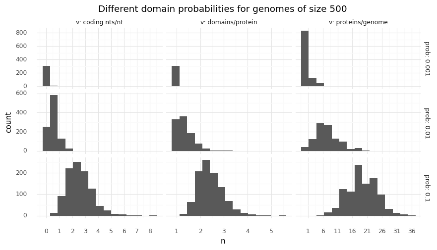

# Tutorials

## Simple Experiment

As a simple example one could try to teach cells to fix CO2 in a simulation.
Cells should create a set of proteins that can convert CO2 into some biologically useful form.
We could define acetyl-CoA as the desired end product.
So, a cell's survival will be based on its intracellular acetyl-CoA concentration and CO2 will be supplied in abundance.

### Chemistry

The basis for how cells are allowed to achieve that is defined by the simulation's chemistry.
Here, we will use the [Wood-Ljungdahl pathway](https://en.wikipedia.org/wiki/Wood%E2%80%93Ljungdahl_pathway) as a starting point.
There are a few molecule species and reactions that eventually end up in acetylating coenzyme A.
Below, we create a file _chemistry.py_ in which we define all these molecules and reactions.
For the sake of brevity some steps in the carbonyl branch were aggregated.

```python
# chemistry.py
from magicsoup.containers import Molecule, Chemistry

NADPH = Molecule("NADPH", 200.0 * 1e3)
NADP = Molecule("NADP", 100.0 * 1e3)
ATP = Molecule("ATP", 100.0 * 1e3)
ADP = Molecule("ADP", 70.0 * 1e3)

methylFH4 = Molecule("methyl-FH4", 360.0 * 1e3)
methylenFH4 = Molecule("methylen-FH4", 300.0 * 1e3)
formylFH4 = Molecule("formyl-FH4", 240.0 * 1e3)
FH4 = Molecule("FH4", 200.0 * 1e3)
formiat = Molecule("formiat", 20.0 * 1e3)
co2 = Molecule("CO2", 10.0 * 1e3, diffusivity=1.0, permeability=1.0)

NiACS = Molecule("Ni-ACS", 200.0 * 1e3)
methylNiACS = Molecule("methyl-Ni-ACS", 300.0 * 1e3)
HSCoA = Molecule("HS-CoA", 200.0 * 1e3)
acetylCoA = Molecule("acetyl-CoA", 260.0 * 1e3)

MOLECULES = [
    NADPH,
    NADP,
    ATP,
    ADP,
    methylFH4,
    methylenFH4,
    formylFH4,
    FH4,
    formiat,
    co2,
    NiACS,
    methylNiACS,
    HSCoA,
    acetylCoA,
]

REACTIONS = [
    ([NADPH], [NADP]),
    ([ATP], [ADP]),
    ([co2], [formiat]),
    ([formiat, FH4], [formylFH4]),
    ([formylFH4], [methylenFH4]),
    ([methylenFH4], [methylFH4]),
    ([methylFH4, NiACS], [FH4, methylNiACS]),
    ([methylNiACS, co2, HSCoA], [NiACS, acetylCoA]),
]
```

Each molecule species was created with a unique name and an energy.
This energy has effects on reaction energies (more on this in [Molecule energies](#molecule-energies)).
Any number of molecules in this simulation is expressed in _mol_
and for this energy it makes sense to think of it in terms of _J/mol_.
So, here _ATP_ is defined with _100 kJ/mol_.
Except for _CO2_ all defaults are kept.
For _CO2_ permeability and diffusivity is increased to account for the fact that
it diffuses rapidly and can permeate through cell membranes.

The reactions are tuples of lists of these molecule species.
The first tuple entry defined all substrates, the second all products.
A stoichiometric number >1 can be expressed by listing the molecule species multiple times.
Any reaction can happen in both directions, so tt is not necessary to define the reverse reaction.
In which direction a reaction will progress depends on its reaction energy and quotient.

### Setup

Eventually, we want to create [Chemistry][magicsoup.containers.Chemistry]
and [World][magicsoup.world.World] and then setp through time by repetitively calling different functions.
These functions would let the cells catalyze reactions and transport molecules,
diffuse and permeate molecules, kill cells, replicate cells, and create mutations.
Such a setup is shown below as _main.py_.
However, some functions are not implemented yet.

```python
# main.py
import magicsoup as ms
from .chemistry import REACTIONS, MOLECULES

def add_molecules(...):
    ...

def add_cells(...):
    ...

def kill_cells(...):
    ...

def replicate_cells(...):
    ...

def mutate_cells(...):
    ...

def main():
    chemistry = ms.Chemistry(reactions=REACTIONS, molecules=MOLECULES)
    world = ms.World(chemistry=chemistry)
    
    for _ in range(10_000):
        add_molecules()
        add_cells()
        world.enzymatic_activity()
        world.diffuse_molecules()
        world.degrade_molecules()
        kill_cells()
        replicate_cells()
        mutate_cells()
        world.increment_cell_survival()

if __name__ == "__main__":
    main()
```

Here, we would let the simulation run for 10k steps.
In each step a certain number of cells is added, then cells can work and molecules can diffuse,
and then cells are being killed or replicated based on their status.
Towards the end of the step all cells experience mutations and finnally -- for monitoring purposes --
the age of all surviving cells gets incremented by 1.

### Adding molecules

When [World][magicsoup.world.World] is instantiated by default it fills the map with molecules
of all molecule species to an average concentration of 10.
So, there are already some molecules.
However, we want to bring the cells to fix CO2, and if they are successful they will consume CO2.
So, we have to regularly supply CO2.

Additionally, the cells will need energy.
Using CO2 to acetylate CoA takes up energy.
For now, cells have some energy in the form of ATP and NADPH.
But once they figure out how to use it they wil quickly convert all ATP to ADP and all NADPH to NADP.
In our setup the cells have no means to restore these high energy molecules.
So, the world map has a certain energy stored that will run out as some point.
To give the cells ample time to develop, we can regularly replenish these energy carriers.

One naive approach would be to add CO2, ATP, and NADPH every round.
However, then over time these molecule concentrations would explode.
To avoid that we can be a bit more careful.
Here is another approach:

```python
def add_molecules(world: ms.World, co2: int, atp: int, adp: int, nadph: int, nadp: int):
    # keep NADPH/NADP and ATP/ADP ratios high
    for high, low in [(atp, adp), (nadph, nadp)]:
        high_avg = world.molecule_map[high].mean().item()
        low_avg = world.molecule_map[low].mean().item()
        if high_avg / (low_avg + 1e-4) < 5.0:
            world.molecule_map[high] += world.molecule_map[low] * 0.99
            world.molecule_map[low] *= 0.01

    # add CO2 up to a certain amount
    if world.molecule_map[co2].mean() < 50.0:
        world.molecule_map[co2] += 10.0
```

Energy carriers are converted and always kept in a high high-to-low energy ratio.
_I.e._ the same amount that is added to ATP, is substracted from ADP.
The ratios are always kept above 5, so that $ATP \rightleftharpoons ADP$
and $NADPH \rightleftharpoons NADP$ will always be a fast reactions.
CO2 on the other handside is constantly added.
To avoid infinitly growing CO2 concentrations we stop adding CO2
when concentrations are above 50.
When CO2 is on average 50 while other molecule species are on average 10,
reactions that use up CO2 will be favoured by the reaction quotient.

### Adding cells

So far, there are no cells yet.
Cells can be added through [add_cells()][magicsoup.world.World.add_cells]
by providing genomes.
They will be placed in random positions on the map and take up half the molecules
that were on that position.
There is a helper function `random_genome()` that can be used to generate genomes of a certain size.

From the setup above it is already apparent that cells will be added regularly.
One could add cells only once and then start the simulation, but it is very likely that they just all die
after a few time steps.
With completely random starting genomes, most cells will be inviable.
They will live for a few rounds and then die.
So, we want to keep adding cells until some viable ones appear.
To not gradually fill up the map with inviable cells we can just keep a certain amount of cells on the map.

```python
def add_cells(world: ms.World):
    dn = 1000 - len(world.cells)
    if dn > 0:
      genomes = [ms.random_genome(s=500) for _ in range(dn)]
      world.add_cells(genomes=genomes)
```

In the example above up to 1000 cells with random genomes are added every round.
If there are more than 1000 cells, no cell will be added anymore.
Usually, once a cell is viable and starts growing a colony, overall cell count will quickly exeed 1000.
It would also make sense to parametrize the maximum number of cells added and the genome size (here 500).
They are good for trimming the simulation.

### Replicating and killing cells

These are the main levers for exerting evolutionary pressure.
Most time will go into fine-tuning them.
Generally, we want to slowly increase or decrease the likelihood of cells dying or replicating over a certain variable (more on this in [Selection](#selection)).
Here, these variables are intracellular concentration of specific molecule species.

Let's start with killing cells.
Which molecule species we look at for killing cells is really just trial-and-error.
It makes sense to choose something that would not contradict the replication criterion.
Here, we will kill cells with low NADPH and ATP concentrations.
Since NADPH and ATP concentrations are high anyway this should initially be easy for cells to avoid.
A helper function for sampling is defined.
Cells are killed with [kill_cells()][magicsoup.world.World.kill_cells] by providing their indexes.

```python
def sample(p: torch.Tensor) -> list[int]:
    idxs = torch.argwhere(torch.bernoulli(p))
    return idxs.flatten().tolist()

def kill_cells(world: ms.World, atp: int, nadph: int):
    # low ATP
    x0 = world.cell_molecules[:, atp]
    idxs0 = sample(.5**4 / (.5**4 + x0**4))

    # low NADPH
    x1 = world.cell_molecules[:, nadph]
    idxs1 = sample(.5**4 / (.5**4 + x1**4))
    
    world.kill_cells(cell_idxs=list(set(idxs0 + idxs1)))
```

Cell replication should be based on acetyl-CoA.
Here, we could make the cell invest some energy in form of acetyl-CoA by converting it back to HS-CoA (taking away the acetyl group).
That way a cell has to continuously produce acetyl-CoA in order to replicate.
The better it can do that, the more frequent it will replicate.
Cells can be replicated with [replicate_cells()][magicsoup.world.World.replicate_cells] by supplying their indexes.
The indexes of successfully replicated cells are returned (if the cell has no space to replicate, it will not do so).

```python
def replicate_cells(world: ms.World, aca: int, hca: int):
    x = world.cell_molecules[:, aca]
    chosen = sample(x**5 / (x**5 + 15.0**5))
    
    allowed = torch.argwhere(world.cell_molecules[:, aca] > 2.0).flatten().tolist()
    idxs = list(set(chosen) & set(allowed))

    replicated = world.replicate_cells(parent_idxs=idxs)
    if len(replicated) > 0:
        parents, children = list(map(list, zip(*replicated)))
        world.cell_molecules[parents + children, aca] -= 1.0
        world.cell_molecules[parents + children, hca] += 1.0
```

Here, we use a function to sample replicating cells based on acetyl-CoA concentrations.
For all replicated cells 2 mol acetyl-CoA should then be converted to HS-CoA.
That means a cell that was chosen to replicate but doesn't have at least 2 mol acetyl-CoA cannot replicate.
After a cell sucessfully replicated its molecules are equally shared with new cell (called _child_ here).
To perform the conversion 1 mol of acetyl-CoA is removed and 1 mol of HS-CoA is added for both cells.

### Mutating cells

To continously create variation among cells they are all mutated at every step.
There are some functions for mutating genomes already provided in the `ms.mutations` module.
But anything that mutated strings can be used.
Here, I am using [point_mutations()][magicsoup.mutations.point_mutations] to apply random
point mutations with a rate of 1e-3 per nucleotide. 10% of them are InDels.

```python
def mutate_cells(world: ms.World):
    mutated = ms.point_mutations(seqs=[d.genome for d in world.cells])
    world.update_cells(genome_idx_pairs=mutated)
```

[update_cells()][magicsoup.world.World.update_cells] is used to update the cells whose genome was altered.
This function derives each cell's new proteome and does all required updates.
It is currently the performance bottleneck, so it's best to only provide the cells that were really altered
(don't always recalculate all proteomes).

### Putting it all together

Finally, we can combine everything in _main.py_.
In the functions above I always used indexes to reference certain molecule species on
`world.molecule_map` and `world.cell_molecules`. Those indexes are derived from [Chemistry][magicsoup.containers.Chemistry].
Molecule species are always ordered in the same way as on `chemistry.molecules`.
Below, I am creating a name-to-index mapping for these molecule with `mol_2_idx = {d.name: i for i, d in enumerate(chemistry.molecules)}`
after [Chemistry][magicsoup.containers.Chemistry] is instantiated.

```python
# main.py
import torch
import magicsoup as ms
from .chemistry import REACTIONS, MOLECULES


def add_molecules(world: ms.World, co2: int, atp: int, adp: int, nadph: int, nadp: int):
    # keep NADPH/NADP and ATP/ADP ratios high
    for high, low in [(atp, adp), (nadph, nadp)]:
        high_avg = world.molecule_map[high].mean().item()
        low_avg = world.molecule_map[low].mean().item()
        if high_avg / (low_avg + 1e-4) < 5.0:
            world.molecule_map[high] += world.molecule_map[low] * 0.99
            world.molecule_map[low] *= 0.01

    # add CO2 up to a certain amount
    if world.molecule_map[co2].mean() < 50.0:
        world.molecule_map[co2] += 10.0


def add_cells(world: ms.World):
    dn = 1000 - len(world.cells)
    if dn > 0:
        genomes = [ms.random_genome(s=500) for _ in range(dn)]
        world.add_cells(genomes=genomes)


def sample(p: torch.Tensor) -> list[int]:
    idxs = torch.argwhere(torch.bernoulli(p))
    return idxs.flatten().tolist()


def kill_cells(world: ms.World, atp: int, nadph: int):
    # low ATP
    x0 = world.cell_molecules[:, atp]
    idxs0 = sample(0.5**4 / (0.5**4 + x0**4))

    # low NADPH
    x1 = world.cell_molecules[:, nadph]
    idxs1 = sample(0.5**4 / (0.5**4 + x1**4))

    world.kill_cells(cell_idxs=list(set(idxs0 + idxs1)))


def replicate_cells(world: ms.World, aca: int, hca: int):
    x = world.cell_molecules[:, aca]
    chosen = sample(x**5 / (x**5 + 15.0**5))

    allowed = torch.argwhere(world.cell_molecules[:, aca] > 2.0).flatten().tolist()
    idxs = list(set(chosen) & set(allowed))

    replicated = world.replicate_cells(parent_idxs=idxs)
    if len(replicated) > 0:
        parents, children = list(map(list, zip(*replicated)))
        world.cell_molecules[parents + children, aca] -= 1.0
        world.cell_molecules[parents + children, hca] += 1.0


def mutate_cells(world: ms.World):
    mutated = ms.point_mutations(seqs=[d.genome for d in world.cells])
    world.update_cells(genome_idx_pairs=mutated)


def main():
    chemistry = ms.Chemistry(reactions=REACTIONS, molecules=MOLECULES)
    world = ms.World(chemistry=chemistry)

    mol_2_idx = {d.name: i for i, d in enumerate(chemistry.molecules)}
    CO2_IDX = mol_2_idx["CO2"]
    ATP_IDX = mol_2_idx["ATP"]
    ADP_IDX = mol_2_idx["ADP"]
    NADPH_IDX = mol_2_idx["NADPH"]
    NADP_IDX = mol_2_idx["NADP"]
    ACA_IDX = mol_2_idx["acetyl-CoA"]
    HCA_IDX = mol_2_idx["HS-CoA"]

    for _ in range(10_000):
        add_molecules(
            world=world,
            co2=CO2_IDX,
            atp=ATP_IDX,
            adp=ADP_IDX,
            nadph=NADPH_IDX,
            nadp=NADP_IDX,
        )
        add_cells(world=world)
        world.enzymatic_activity()
        world.diffuse_molecules()
        world.degrade_molecules()
        kill_cells(world=world, atp=ATP_IDX, nadph=NADPH_IDX)
        replicate_cells(world=world, aca=ACA_IDX, hca=HCA_IDX)
        mutate_cells(world=world)
        world.increment_cell_survival()

if __name__ == "__main__":
    main()
```

## Boilerplate

These are some examples for monitoring, checkpointing, and parametrizing simulations.
Let's assume a setup like described in the [experiment above](#simple-experiment).
So, the _main.py_ looks something like this:

```python
# main.py
import torch
import magicsoup as ms
from .chemistry import REACTIONS, MOLECULES

...

def main():
    chemistry = ms.Chemistry(reactions=REACTIONS, molecules=MOLECULES)
    world = ms.World(chemistry=chemistry)
    ...

    for _ in range(10_000):
        ...

if __name__ == "__main__":
    main()
```

### Monitoring

One nice tool for monitoring an ongoing simulation run is [TensorBoard](https://www.tensorflow.org/tensorboard).
It's an app that watches a directory of your run and displays logged data as line charts, histograms, images and more.
It can be installed from [pipy](https://pypi.org/project/tensorboard/).
_pytorch_ already includes a `SummaryWriter` that can be used for writing these logging files.

```python
# main.py
import datetime as dt
from pathlib import Path
import torch
from torch.utils.tensorboard import SummaryWriter
import magicsoup as ms
from .chemistry import REACTIONS, MOLECULES

THIS_DIR = Path(__file__).parent
...

def main():
    now = dt.datetime.now().strftime("%Y-%m-%d_%H-%M")
    writer = SummaryWriter(log_dir=THIS_DIR / "runs" / now)

    chemistry = ms.Chemistry(reactions=REACTIONS, molecules=MOLECULES)
    world = ms.World(chemistry=chemistry)
    ...

    for _ in range(10_000):
        ...

if __name__ == "__main__":
    main()
```

When it is instantiated it creates `log_dir` if it doesn't already exist.
This is where all the logging files will go.
Add `runs/` to `.gitignore` to avoid committing this directory.
In the example above, I am also adding the current date and time as a a subdirectory,
so that you can start a run multiple times without overriding the previous ones.

How to use the `SummaryWriter` is explained in [the docs](https://pytorch.org/docs/stable/tensorboard.html).
It supports a few data types.
We will start with recording some scalars about cell growth.
Additionally, we can visualize the cell map by taking a picture of it.
These pictures are a bit heavy, so we will only capture one every 10 steps. 

```python
# main.py
import datetime as dt
from pathlib import Path
import torch
from torch.utils.tensorboard import SummaryWriter
import magicsoup as ms
from .chemistry import REACTIONS, MOLECULES

THIS_DIR = Path(__file__).parent
...

def write_scalars(world: ms.World, writer: SummaryWriter, step: int):
    writer.add_scalar("Cells/total[n]", len(world.cells), step)
    writer.add_scalar("Cells/Survival[avg]", world.cell_survival.mean(), step)
    writer.add_scalar("Cells/Divisions[avg]", world.cell_divisions.mean(), step)

def write_images(world: ms.World, writer: SummaryWriter, step: int):
    writer.add_image("Maps/Cells", world.cell_map, step, dataformats="WH")

def main():
    now = dt.datetime.now().strftime("%Y-%m-%d_%H-%M")
    writer = SummaryWriter(log_dir=THIS_DIR / "runs" / now)

    chemistry = ms.Chemistry(reactions=REACTIONS, molecules=MOLECULES)
    world = ms.World(chemistry=chemistry)
    ...

    for step in range(10_000):
        ...
        write_scalars(world=world, writer=writer, step=step)
        if step % 10 == 0:
            write_images(world=world, writer=writer, step=step)

if __name__ == "__main__":
    main()
```

There is a pattern to labelling the variables on how they will be displayed in the app.
_E.g._ there will be a _Cells_ and a _Maps_ section.
The image dataformat is `WH` because dimension 0 of `world.cell_map` represents the x axis,
and dimension 1 the y axis.
You can start the app by pointing it at the runs directory `tensorboard --logdir=./runs`.

### Parameters

You might want to parametrize _main.py_ so that you can start it with different conditions.
Let's say we want to parametrize the number of steps: sometimes we just want to run a few steps to see if it works,
sometimes we want to start a long run with thousands of steps.
There are many tools for that.
I am going to stick to the standard library and use [argparse](https://docs.python.org/3/library/argparse.html).

```python
# main.py
import json
import datetime as dt
from pathlib import Path
from argparse import ArgumentParser, Namespace
import torch
import magicsoup as ms
from .chemistry import REACTIONS, MOLECULES

THIS_DIR = Path(__file__).parent
...

def main(args: Namespace):
    outdir = THIS_DIR / "runs" / dt.datetime.now().strftime("%Y-%m-%d_%H-%M")
    outdir.mkdir(exist_ok=True, parents=True)
    with open(outdir / "hparams.json", "w") as fh:
        json.dump(vars(args), fh)

    chemistry = ms.Chemistry(reactions=REACTIONS, molecules=MOLECULES)
    world = ms.World(chemistry=chemistry)
    ...

    for _ in range(args.n_steps):
        ...

if __name__ == "__main__":
    parser = ArgumentParser()
    parser.add_argument("--n_steps", default=10_000, type=int)
    parsed_args = parser.parse_args()
    main(args=parsed_args)
```

Now every run can be started with a diffent `n_steps`, so it makes sense to note
parameters somewhere when starting a new run.
Here, I am doing this by just writing `var(args)` to JSON.
This can also be done with [SummaryWriter.add_hparams](https://pytorch.org/docs/stable/tensorboard.html#torch.utils.tensorboard.writer.SummaryWriter.add_hparams).
As in the TensorBoard example above I am creating a _runs_ directory with the current date and time.

### Checkpoints

[World][magicsoup.world.World] has some functions for saving (and loading) itself.
[save()][magicsoup.world.World.save] is used to save the whole world object as pickle file.
It can be restored using [from_file()][magicsoup.world.World.from_file].
However, during the simulation not everything on the world object changes.
A smaller and quicker way to save is [save_state()][magicsoup.world.World.save_state].
It only saves the parts which change when running the simulation (will write a few `.pt` files).
A state can be restored with [load_state()][magicsoup.world.World.load_state].
So, in the beginning one [save()][magicsoup.world.World.save] is needed to save the whole object.
Then, [save_state()][magicsoup.world.World.save_state] can be used to save a certain time point.

```python
# main.py
import datetime as dt
from pathlib import Path
import torch
import magicsoup as ms
from .chemistry import REACTIONS, MOLECULES

THIS_DIR = Path(__file__).parent
...

def main():
    outdir = THIS_DIR / "runs" / dt.datetime.now().strftime("%Y-%m-%d_%H-%M")
    outdir.mkdir(exist_ok=True, parents=True)

    chemistry = ms.Chemistry(reactions=REACTIONS, molecules=MOLECULES)
    world = ms.World(chemistry=chemistry)
    world.save(rundir=outdir)
    ...

    for step in range(10_000):
        ...
        if step % 100 == 0:
            world.save_state(statedir=outdir / f"step={step}")

if __name__ == "__main__":
    main()
```

As in the examples above I am creating a _runs_ directory with the current date and time.
I am also not saving every step to reduce the time spend saving and the size of _runs/_.

## Selection

Replication and survival will guide randomly muated proteomes.
In the [experiment above](#simple-experiment) I just used some functions to
derive a probability for killing or replicating cells based on intracellular ATP, NADPH, and acetyl-CoA concentrations.

```python
def sample(p: torch.Tensor) -> list[int]:
    idxs = torch.argwhere(torch.bernoulli(p))
    return idxs.flatten().tolist()


def kill_cells(world: ms.World, atp: int, nadph: int):
    # low ATP
    x0 = world.cell_molecules[:, atp]
    idxs0 = sample(0.5**4 / (0.5**4 + x0**4))

    # low NADPH
    x1 = world.cell_molecules[:, nadph]
    idxs1 = sample(0.5**4 / (0.5**4 + x1**4))

    world.kill_cells(cell_idxs=list(set(idxs0 + idxs1)))


def replicate_cells(world: ms.World, aca: int, hca: int):
    x = world.cell_molecules[:, aca]
    chosen = sample(x**5 / (x**5 + 15.0**5))

    allowed = torch.argwhere(world.cell_molecules[:, aca] > 2.0).flatten().tolist()
    idxs = list(set(chosen) & set(allowed))

    replicated = world.replicate_cells(parent_idxs=idxs)
    if len(replicated) > 0:
        parents, children = list(map(list, zip(*replicated)))
        world.cell_molecules[parents + children, aca] -= 1.0
        world.cell_molecules[parents + children, hca] += 1.0
```

How exactly these probabilities are derived is actually a part of fine-tuning the simulation.
They can make a big difference in how quickly cells learn something.
When setting up a new simulation it is likely that at first cells seem to not learn anything at all.
This can often be attributed to cell survival (here, the average number of time steps cells survive)
and replication rate (here, the average number of times a cell divided).
There are some common patterns:

- **no cell growth at all** All cells that ever exist are the random cells which are automatically
  added. Cell survival is too low. Maybe some cells manage to replicate, but there is no sustained
  growth because cells die before they can replicate a second time.
- **overcrouded map** Cells overgrow the map, and then just persist without appreciable
  metabolism. Cell survival is too high. Every now and then a cell manages to divide, and since cells
  rarely die, they fill up the map. These cells stall any evolutionary process as they take up space
  and molecules without doing anything. Maybe a superior cell exists somewhere, but since it is surrounded
  by other cells, it cannot divide. Thus, it cannot replicate its surperior genome.
- **wavefront, then total extinction** At some point a colony forms and cells quickly replicate. As the
  colony grows outwards, cells in the center of the colony die. It becomes a wavefront of quickly
  dividing cells that runs over the map. After it has ecompassed the entire map once, it disappears.

In general, the wavefront is a good sign because it means some cell figured out how to increase its chance of dividing.
Using the [experiment from above](#simple-experiment) it is likely that at some time point
a cell with an acetyl-CoA transporter appears. As long as there is acetyl-CoA on the map, this cell (and all its descendants)
will be able to quickly replicate.
Their NADPH and ATP concentrations will get low and they will only live a few time steps.
But before they die, they will probably manage to replicate at least once.
During this exponential growth phase, the proteome that allows the highest replication rate will dominate (_e.g._ the fasted acetyl-CoA transporter).
However, at some point all the world's acetyl-CoA is exhausted, replication stops, and the remaining cells die.

The only chance to continue is for some cell to learn how to restore acetyl-CoA.
A cell could for example learn the next step and create transporters for CO2, HS-CoA, and methyl-Ni-ACS.
However, such a proteome will only become surperior once all the world's acetyl-CoA has been exhausted.
Between the start of the growth phase and the extinction event such a proteome has to appear and survive until the extinction event.
The chances of this happening can be increased reducing the speed of this wavefront,
_i.e._ having more time steps between growth start and the extinction event.

### Survival and replication rate

As mentioned above it is desireable to create a stable colony that slowly grows.
So, you have to be careful with replication probabilities.
On the one hand, a better proteome should be rewarded with higher replication rates.
On the other hand, it should take a colony a long time to overgrow the entire map.
Additionally, useless cells/proteomes should die to free up molecules and space.
It makes sense to think about the likely intracellular molecule concentrations and then fit a long (slowly increasing or decreasing)
sigmoid function to it.
Personally, I am currently sticking to functions of the form $f_{inc}(x) = x^n / (x^n + c^n)$ and $f_{dec}(x) = c^n / (x^n + c^n)$.

In addition, one has to remember that these probabilities accumulate for each cell each time step.
_I.e._ being killed is an event that has to happen only once to any cell.
Say a cell is killed with probability $p_k(X) =(X^7 + 1)^{-1}$ and replicates with probability $p_r(X) = X^5 / (X^5 + 15^5)$, where
X is some hypothetical molecule species.
The likeliehood that a cell dies or replicates at least once over the course of multiple time steps is shown below for cells with
different intracellular X concentrations.


_Probability over time steps of a cell dying or dividing at least once when the chance to die depends on molecule concentration X with $p(X) =(X^7 + 1)^{-1}$ and the chance to replicate depends on it with $p(X) = X^5 / (X^5 + 15^5)$._

These two events together influence cells growth.
If a cell replicates, it increases to overall number of cells.
If a cell dies, it reduces the overall number of cells, and prohibits this cell from replicating.
We can simulate how cells with different X concentrations would grow given these kill and replication probabilities:


_Simulated growth of cells with different molecule concentrations X when the chance to die depends on molecule concentration X with $p(X) =(X^7 + 1)^{-1}$ and the chance to replicate depends on it with $p(X) = X^5 / (X^5 + 15^5)$._

It helps to take a look at such a plot in order to see if the chosen probability functions lead to a balanced growth.
Here, the probability functions would be good if we expect $X \in [1,5]$ and $X \ge 3$ to be a healthy cell.

### Splitting cells

To keep cells in exponential growth phase indefinitely you can split them.
In this simulation splitting cells would equate to randomly selecting a few cells, creating a new world map,
then placing these selected cells on the new world map.
This way the cells have new molecules and open space to grow.

However, the split itself will select for fast replicating cells.
Let's take the example from above with $p_k(X) =(X^7 + 1)^{-1}$ and $p_r(X) = X^5 / (X^5 + 15^5)$.
The plot below shows simulated cell growth, where cells were split with different split ratios whenever the total number of cells exeeded 7k.
Gray areas represent the total number of cells, stacked bar charts show the cell type composition before the split.
We have cell types with X concentrations of 3, 4, 5, and 6.


_Simulated growth of cells with different molecule concentrations X when the chance to die depends on molecule concentration X with $p(X) =(X^7 + 1)^{-1}$ and the chance to replicate depends on it with $p(X) = X^5 / (X^5 + 15^5)$. Cells are split at different split ratios whenever they exceed a total count of 7000. Gray area represents total cell count, bars represent cell type composition before the split._

As you can see all cell types except the fastest growing cell type (with $X=5$) quickly disappear.
Higher split ratios reduce stochastic effects a little bit, but the trend is the same.
However, this cell type might not be the one that we want.
_E.g._ $X=5$ might be a cell that just created a very fast acetyl-CoA importer.
Maybe $X=3$ was a cell type that was able to restore its own acetyl-CoA, but it was filtered out after a few splits.

As long as there is enough acetyl-CoA on the map cells are not pressured into creating their own.
So, the extinction event from above is not all bad.
On the one hand, it can give acetyl-CoA-creating cell types a chance.
On the other hand, it might just erase all of cells.


## Genomes

### Genome size

In the [experiment above](#simple-experiment) cells were randomly added each round.
They each had a random genome of 500 base pairs length.

```python
def add_cells(world: ms.World):
    dn = 1000 - len(world.cells)
    if dn > 0:
        genomes = [ms.random_genome(s=500) for _ in range(dn)]
        world.add_cells(genomes=genomes)
```

During the simulation these genomes can become shorter or longer through random mutations.
But in the beginning it usually takes a few hundred or thousand time steps until a first colony appears.
This process can be sped up by giving cells larger starting genomes.
Larger genomes generally produce more proteins.
But there are also other effects to consider.
The plot below shows the average number of proteins per genome, domains per protein, and coding nucleotides per nucleotide.


_Distributions for proteins per genome, domains per protein, and coding nucleotides per nucleotide for different genome sizes with domain probability 0.01_

With default settings genomes of size 500 create about 1 to 16 proteins.
Most of them consist of 1 domain, some have 2 domains.
Roughly every second nucleotide codes for some domain.
We know that for some reactions in the Wood-Ljungdahl pathway multiple domains must be energetically coupled in order to work.
So, it would help if the cell has a chance of recieving a few multi-domain proteins already at the start.
Additionally, we can see that single nucleotide substitutions in the genome have roughly a 50% chance of changing the proteome.
If this number is higher, proteomes will vary more but also be more unstable.

### Other parameters

When [World][magicsoup.world.World] is initialized, it creates a [Genetics][magicsoup.genetics.Genetics] instance.
This instances carries factories for catalytic, transporer, and regulatory domains.
These domains map nucleotide sequences to domains and their specifications (see [Mechanics](./mechanics.md) and [Genetics][magicsoup.genetics.Genetics] for details).
By changing the frequency with which nucleotide sequences can encode domains, we can change the composition of genomes.
By default all 3 domain types are encoded by 6 nucleotides and 1% of all 6-nucleotide sequences encode for 1 of those domain types.
Below is a plot like above that shows distributions for genomes of size 500 with domain type frequencies of 0.1%, 1% and 10%.


_Distributions for proteins per genome, domains per protein, and coding nucleotides per nucleotide for different domain probabilities with genome size 500_

With 10% frequency proteoms of size 500 create 6 to 31 proteins.
Most of these proteins have 2 or 3 domains, and each nucleotide encodes 2 or 3 domains at the same time.
This would probably create very complex cells from the start but make it very difficult for them to evolve.
Every mutation would have an effect on multiple proteins at the same time, and single domain proteins would be difficult to achieve.

In any case, if you want to change [Genetics][magicsoup.genetics.Genetics] for your simulation, you have to create your
own instance and add it to [World][magicsoup.world.World] after it has been instantiated:

```python
world = ms.World(...)
world.genetics = ms.Genetics(...)
```

See the [Genetics reference][magicsoup.genetics.Genetics] for more details.

## Molecule energies

In the [experiment above](#simple-experiment) some molecule species were defined in _chemistry.py_ with energies.

```python
formiat = Molecule("formiat", 20.0 * 1e3)
co2 = Molecule("CO2", 10.0 * 1e3, diffusivity=1.0, permeability=1.0)
```

In this simulation a chemical reaction is regarded as the decomposition of substrates and the creation of products.
Whether this reaction will proceed, stall, or turn around is defined by the [Nernst equation](https://en.wikipedia.org/wiki/Nernst_equation).
_I.e._ the reaction energy together with the world's temperature will define the equilibrium constant of any reaction
(this is explained in detail in [Mechanics](./mechanics.md)).
In the example above $CO2 \rightleftharpoons formiat$ has a reaction energy of 10 kJ/mol and would create a equilibrium constant of roughly 0.02.
If the reaction energy would have been defined as only 10 J/mol, the equilibrium constant would be almost 1.0.
So, the range of these energies have a big impact on the equilibrium constants of reactions in the simulations.
For the plot below, chemistries with energies of around 10 kJ/mol, 100 kJ/mol, and 200 kJ/mol were created and
random proteins were generated. The equilibrium constant distributions of reactions catalyzed by these proteins are shown.


_Log10 of equilibrium constant distributions of random proteins at different temperatures for different reactions energies_

With lower reaction energies reactions can be more dirven by reaction quotients.
For energetically coupled transporter and catalytic domains this means transporters can power more reactions,
_i.e._ cells can make more use of concentration gradients.

## Molecule maps

When instantiating [World][magicsoup.world.World] by default all molecule species will added to `world.molecule_map`, normally distributed,
with an average concentration of 10.
In the [experiment above](#simple-experiment) this made sense for most molecule species.
But for energy carriers ATP/ADP and NADPH/NADP, and for the carbon source CO2 we created functions to regularly change these molecule distributions.
For adding CO2, one could also think of creating gradient like shown below.
This could for example introduce a spatial dependence for cell growth.


_Molecule species X is added to molecule map and allowed to diffuse  to create a 1D gradient (top) or 2D gradients (bottom)._

In the plot above, these gradients were created by adding CO2 to specific pixels on the map, and removing them from other other.
The gradients emerge through diffusion.
However, the gradient takes a few hundred steps to reach its equilibrium.
You can also figure out the equilibrium state and initialize the molecule map with it immediately.
In this case, care must be taken to use the correct device.

```python
n = int(world.map_size / 2)
device = world.molecule_map.device

ones = torch.ones((world.map_size, world.map_size))
linspace = torch.cat([
    torch.linspace(1.0, 100.0, n),
    torch.linspace(100.0, 1.0, n)
])
gradient = torch.einsum("xy,x->xy", ones, linspace)

world.molecule_map[co2] = gradient.to(device)
```

The code above creates the 1D gradient that was shown in the plot for CO2.
By effectively doing `gradient.to(world.molecule_map.device)` we make sure that
the created tensor will be send to the same device that `world.molecule_map` was on.
