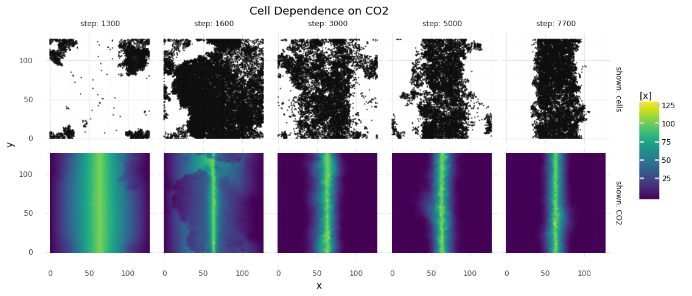

# Carbon Fixation

Here, I am trying to bring the cells to fix CO2.
A chemistry representing the [Wood Ljungdahl pathway](https://www.ncbi.nlm.nih.gov/pmc/articles/PMC2646786/) is defined.
Under energy expenditure CO2 can acetylate HS-CoA within 6 steps.

In this simulation replication probability is tied to intracellular acetyl-CoA concentrations and acetyl-CoA is converted to HS-CoA when a cell replicates.
This should make cells find a way to constanly replenish acetyl-CoA.
New CO2, and energy in the form of ATP and NADPH is provided in abundance.


_World map for cells and CO2 is shown. Columns represent different time steps of the simulation, the top row shows cells, the bottom row shows CO2 concentrations. CO2 is constantly replenished on the vertical middle-line, creating a gradient. First, cells grow randomly over the map, exhausting acetyl-CoA. Then, most cells die. Only cells that know how to replenish acetyl-CoA from CO2 and that are close to the CO2 source survive._

- [main.py](./main.py) runs the simulation
- [runs/](./runs/) saved runs (in gitignore)
- [analyze_2023-01-17_21-45.ipynb](./analyze_2023-01-17_21-45.ipynb) cells formed a stable colony, but they enlarged their genomes without end

```
# short test run:
python -m experiments.e1_co2_fixing.main --n_steps=20
...
# watch progress on tensorboard
tensorboard --logdir=./experiments/e1_co2_fixing/runs
```
